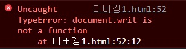

# CSS
## Font

### font-size
- em : 부모 요소 폰트의 대문자 M 너비 기준
- rem : root 폰트 기준
- px : 모니터 1픽셀 기준
- pt : 포인트

### font-style
- normal : 기본
- italic : 기울임체

### font-weight
- normal(400)
- bold(700)

### line-height
- 한 문단이 두 줄 이상이면 줄 간격이 생김
- 줄 간격이 너무 좁거나 넓으면 가독성이 떨어짐
- line-height 속성을 이용하여 줄 간격을 원하는 만큼 조절 가능

### text-decoration
- none : 기본
- underline : 밑줄
- overline : 윗줄
- line-through : 취소선


## Layout

### display
- block : 인라인 레벨 요소를 블록 요소 레벨로 만듦
- inline : 블록 레벨 요소를 인라인 레벨 요소로 만듦
- inline-block : 인라인 레벨 요소와 블록 레벨 요소의 속성을 모두 가지고 있으며 마진과 패딩 지정 가능
- none : 해당 요소를 화면에 출력하지 않음

### float
- 웹 요소를 문서 위에 떠 있게 만듦


## 웹 요소 위치 지정

### 위치 속성
- left : 기준 위치와 요소 사이의 왼쪽 거리 설정
- right : 기준 위치와 요소 사이의 오른쪽 거리 설정
- top : 기준 위치와 요소 사이의 위쪽 거리 설정
- bottom : 기준 위치와 요소 사이의 아래쪽 거리 설정

### position
- static : 문서의 흐름에 맞춰 배치 (기본값)
- relative : 현재 요소의 위치 기준 (static과 유사)
- absolute : static이 아닌 상위 요소 기준
- fixed : 브라우저 창 기준


## Box Model
- content
- padding
- border
- margin

<br /><br /><br />

# 자바스크립트

## console 창으로 debug
```
document.writ();
```
 
자바스크립트 에러가 콘솔 창에 출력됨
  

## "use strict";
자바스크립트의 원래 문법보다 더 엄격하게 만들어 줌

## 호이스팅
함수 안에 있는 선언들을 모두 끌어올려서 해당 함수 유효 범위의 최상단에 선언하는 것을 말한다.

## Array

### 배열 생성 방법
<ol>
<li>
선언, 대괄호([])를 사용하여 생성

```
let arr = [];
```

</li>
<li>
Array 객체와 new 키워드로 생성

```
let arr = new Array();
```
</li>
</ol>

### 배열 관련 메서드
- arr.push(a) : a를 배열 arr의 가장 뒤에 삽입
- arr.concat(a, b, c) : 배열 arr에 a, b, c를 붙임(삽입) -> 배열 원본 변경 X
- arr.join("(구분자)") : 배열 요소를 문자열로 묶어줌 -> 배열 원본 변경 X

## 등호 연산자
- '==' : 자바스크립트의 자동 형변환으로 인해 자료형에 관계없이 값이 같으면 같다는 결과를 출력
- '===' : 자료형과 값을 함께 비교