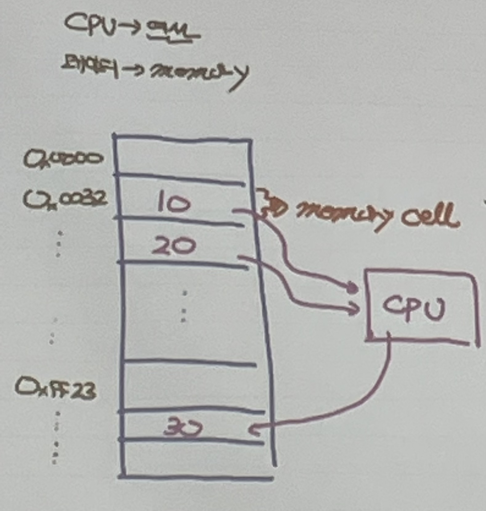

<br /><br /><br />

-----
-----
-----

<br /><br /><br />

2022. 7. 4
<br>
<br>
##### ECMAScript -> React
##### Java -> Database -> Servlet -> Spring
<br>

# Javascript
## ECMAScript

- Netscape사의 "브랜든 아이크" (1995)
- 프로토 타입 기반의 함수형 언어(not object) -> Mocha -> LiveScript -> JavaScript
- 표준화 : ECMA(비영리 표준기구)에서 진행 -> ECMAScript라는 이름으로 표준화가 진행됨
  - JavaScript와 ECMAScript는 다른 것이다.
  - JavaScript = ECMAScript + Client Side Web API(BOM, DOM, Web Storage, IndexedDB, Canvas)
              = ECMAScript + Host API (Node)
  - ECMAScript 2015 = ES6

- MS사에서는 독자적인 스크립트 언어인 JScript를 만들었음
  - Fragmentation(파편화) : 브라우저마다 다른 방식으로 문서를 출력하기 때문에 파편화 현상 발생

- 언어의 모호성
- 구현의 어려움
- JQuery의 등장으로 JS의 인식이 좋아짐
<br />
<br />

## JQuery
### JQuery 장점
- DOM 요소를 쉽게 다룰 수 있음
<br />
<br />

### JQuery 단점
- 기술의 종속성
- 비표준 라이브러리 => 유지보수가 어려움(로직을 사용자가 직접 설계해야 함)

<br />
<br />

# HTML5와 JavaScript
- HTML, CSS 표준 : W3C가 관장
  - HTML : 정형성이 없음 (문법의 오류를 잡아내지 못함), 확장성이 없음 (기존의 HTML 요소로만 웹을 구성)
  - XML : 정형성 O, 확장성 O (HTML을 보완할 수 있는 마크업 언어)
- HTML + XML => XHTML 1.0 (2000년 1월)
<br />
<br />

## WHATW
HTML만을 발전시킴 -> HTML5 (Google, Apple이 사용) => 표준화

## HTML5
- 브라우저만 있으면 모든 프로그램을 실행할 수 있게 하기 위한 목적
- Web Application
- HTML5 = HTML(25%) + CSS3(5%) + JavaScript Web API(70%) (웹 어플리케이션을 만들기 위해)
- HTML5의 등장으로 JavaScript의 위상이 올라감
- 더불어 Node.js도 JS의 위상을 높여줌

## TypeScript
- MS(MicroSoft)의 메타 언어(2012)
- TypeScript 코드를 Transpile하면 JavaScript로 변환됨 (meta programming)
- 컴파일 : 코드를 기계어로 변환
- Meta Programming : JavaScript에는 없는 기능을 TypeScript를 사용하여 추가할 수 있음

<br />
<br />

# Web (Frontend 단)
## Package Manager
- npm(Node Package Manager) : module 간의 버전을 맞춰줌
## Transpiler
- TypeScript
## 자동화 도구
- build, test, deploy를 자동화 -> gulp
## module화 (컴포넌트화)
- webpack
## framework
- Angular(google), React(meta), Vue.js

<br />
<br />

# JavaScript Engine 
- 브라우저를 제작할 때, 브라우저 엔진도 함께 제작 (브라우저 내에 엔진 내장)
- Chrome -> V8 Engine
- Edge -> Chakra Engine
- Safari -> Webkit Engine
- Firefox -> SpiderMonkey Engine
- Node.js Engine -> V8 Engine


<br />
<br />
<br />
<br />

# 변수


- Memory Address : Variable을 이용해 메모리에 접근
  - Memory Address에 대한 직접적인 접근 불가
  - 변수 = 식별자(Identifier)

## Naming Rule
- ($, _) 제외한 특수문자 불가능
- 숫자 시작 불가능

## Variable Declaration (변수 선언)
- 변수 생성

  ### 변수 생성 방법
  - var : function level scope
  - ES6 이후 신규 : block level scope
    - let
    - const

  ```
  var scope;
  ```
  - 결과 : 
  <ol>
    <li>
    JS 엔진에 의해 undefined로 초기화 됨
    </li>
    <li>
    식별자 scope가 execution context(실행 컨텍스트)에 key/value 형태로 저장됨
    </li>
  </ol>
    
    - undefined : primitive value, JS Engine에 의해 사용되므로 개발자의 직접 사용이 지양됨, 변수를 초기화할 때 사용

<br />
<br />

## Variable Hoisting (호이스팅)
  ```
  console.log(score); // undefined

  var score;
  ```
  - 자바스크립트는 런타임 이전에 해당 스코프 내의 변수의 선언을 확인하고 스코프 최상단을로 변수의 선언을 끌어올리는 것처럼 동작

<br />

### keyword : var 
- var keyword로 변수의 중복선언이 가능
  - 실제로는 식별자가 이미 존재하면 var keyword가 없는 것처럼 동작

<br/>

```
var x = 1;
var x = 100;
```
- 초기화 구문이 없으면 무시

<br />

```
var y = 2;
var y;
```
- function level scope 생성
  - 함수 내에서도 호이스팅이 발생

<br />

```
var x = 1;  // 전역변수
if(true) {
  var x = 100;
}

console.log(x); // 100
```
```
var i = 100;
for (var i = 0; i < 5; i++) {
  console.log(i);
}

console.log(i); // 5
```
```
var x = 1;
function myFunc() {
  var x = 100;  // function level scope
  console.log(x); // 100
}
console.log(x); // 1
```

<br />

### ES6에서 추가된 keyword : let, const
  - 중복 선언 금지
  - block level scope
  - let 사용 시 호이스팅이 안되는 것처럼 보임

<br />

#### keyword : let
  - 변수를 일시적으로 사용할 수 없는 구간이 생김 => Temporal DeadZone
```
  let i = 100;
  let i = 10; // SyntaxError : 이미 선언되어 있음
```
```
let score = 100;
{
  let score = 10;
}
```
```
console.log(myVar);
let myVar = 100;  // Error
```

```
let myVar = 1;
{
  console.log(myVar); // ReferenceError: myVar is not defined
  let myVar = 100;
}
```

## 변수의 값 할당


<br />
<br />

## Naming Rule
- ($, _) 제외한 특수문자 불가능
- 숫자 시작 불가능

## Naming convention
<ol>
  <li>
  camelCase
  </li>
  <li>
  snake_case
  </li>
  <li>
  PascalCase
  </li>
  <li>
  typeHungationCase
  </li>
</ol>

<br />
<br />
<br />
<br />


< 기본 용어 >
<ol>
<li>
  Literal(리터럴) : 특정값을 표현하기 위해 사람이 이해할 수 있는 문자, 약속된 기호를 이용하는 표기법(notation)
  <br />
  ex. 3 : 정수 literal
  <br />
  ex. 'Hello', "Hello", `Hello` : 문자 literal
  <br />
  ex. null : null literal (변수가 가리키는 값이 없음)
  <br />
  ex. undefined : undefined literal (변수가 선언되었지만 초기화되지 않음)
  <br />
  ex. {'name': 'kim'} : 객체 literal
  <br />
  ex. [1, 2, 3] : 배열 literal
  <br />
  ex. function() {} : 함수 literal
</li>
<br />
<li>
  Statement(문) : 프로그램의 최소 실행 단위
  <br />
  - program은 statement의 집합
  <br />
  - 'var' 'sum' '=' '1' '+' '2' 각각은 token -> statement를 구성하는 최소 단위
  <br />
  - ';' : statement의 종결을 나타냄 (블록 단위의 중괄호는 self closing이 가능해 세미콜론을 찍지 않아도 됨)
  <br />
  - 세미콜론은 생략해도 ASI(Automatic Semicolon Insertion)가 동작하지만 명확한 code를 위해 생략 X
  <br />
</li>
<li>
  Expression(식) : 평가과정을 통해 값으로 인식되는 구문
</li>
</ol>


<br />
<br />
<br />
<br />

# Data Type
- primitive type(원시타입)
  - number : 정수, 실수를 구분하지 않음, 내부적으로 모든 숫자는 64bit 실수로 처리

    ```
    let myVar = 1.0;
    console.log(myVar === 1); // true
    console.log(3/2); // 1.5
    ```
  
    - infinity : 양의 무한대
    - -infinity : 음의 무한대
    - NaN : Not a number (산술 연산 불가)

  - string
    - 멀티라인 문자열 표현 가능
    - Expression Interpolation(표현식 삽입)
    ```
    let str = '이것은\n소리없는\n아우성';
    let str1 = `이것은
    소리없는
    아우성`;
    ```

    ```
    let name = '홍길동';
    console.log('내 이름은 ' + name + '입니다.);
    console.log(`내 이름은 ${name} 입니다.`);
    ```
  - boolean
  - undefined
  - null
  - symbol (ES6)
    - 겹치지 않는 고유한 값을 부여하기 위해 사용 (Unique)
    - 값이 얼마인지 확인할 수 없음 (출력 불가)
    - Symbol()을 이용해 만듦 : 인자를 사용할 수 있지만..
    
    <br />

    #### Global Symbol Registry 사용
      - Symbol.for() : key 값을 이용해서 Symbol을 찾거나 못찾으면 Symbol을 생성, 등록, 반환
      - Symbol.keyFor() : Symbol 값으로 key를 찾음

    <br />
    
    ```
    const mySymbol = Symbol();
    console.log(typeof mySymbol); // symbol
    console.log(mySymbol);  // Symbol() 값이 노출되지 않음
    ```
    ```
    const mySymbol1 = Symbol('소리없는 아우성');
    const mySymbol2 = Symbol('소리없는 아우성');

    console.log(mySymbol1 === mySymbol2)  // false
    console.log(mySymbol1.description); // 소리없는 아우성

    if(mySymbol1) {
      console.log('Symbol 값이 있음');
    }
    ```
    ```
    const s1 = Symbol.for('mySymbol');
    // global symbol resistry라는 곳이 있음
    // 일단 거기에서 해당 인자를 키로 가지고 있는 symbol을 찾음
    // 만약 존재하지 않으면 symbol을 만들고
    // global symbol registry에 등록하고 symbol을 리턴
    const s2 = Symbol.for('mySymbol');
    console.log(s1 === s2); // true

    console.log(Symbol.keyFor(s2));  // mySymbol
    ```
    ```
    const Direction = {
      'UP': 1,
      'DOWN': 2,
      'LEFT': 3,
      'RIGHT': 4
    }
    let myDirection = Direction.UP; // key 값이 중요

    if(myDirection == Direction.UP) {
      ...
    }
    ```
- Reference type
  - Object

<br />
<br />
<br />
<br />

# 변수의 Data Type
## JavaScript
- JavaScript 변수에 값이 할당되는 시점에 Type이 결정됨 => Type inference (타입 추출) = Dynamic typing(동적 타이핑)
- 이러한 언어를 Dynamic - Weak Type Language
## Java
- 명시적 Type 언어
- Static - Strong Type Language

<br />

# 형변환, Operator
### '+' (overriding)
```
console.log(1 + 2); // 3 
console.log(1 + '2'); // 12 (1이 '1'로 형변환)
console.log(1 + true);  // 2 (true가 1로 형변환)
console.log(1 + null);  // 1 (null이 0으로 형변환) 
console.log(1 + undefined); // NaN (undefined는 형변환이 불가능)
```

### '=='
 : loose equality
### '==='
 : Strict equality
### typeof
 : data type을 알려주는데 항상 표준 data type과 일치하지는 않음
- ex. typeof null : Object

## 형변환 (String)
<ol>
<li>
  String 생성자 함수 -> new 없이 호출
</li>
<li>
  Object.prototype.toString() 호출
</li>
<li>
  '+' 연산자 이용
</li>
</ol>
<br />

```
console.log(typeof String(1));  // string
console.log(typeof String(NaN));  // string
console.log(type (1).toString()); // string
```
- primitive type인 1이 toString() 메서드를 사용할 수 있는 이유는 number인 1이 자바스크립트 엔진에 의해 wrapper 객체가 만들어지기 때문에 조상인 Object의 메서드를 상속해 사용할 수 있음