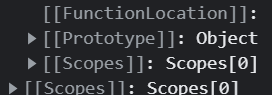

# JavaScript
- 객체지향언어
- 객체기반언어

=> JavaScript를 구성하는 대부분은 <strong>객체</strong>이다.

## mutable vs immutable
- primitive type variable : immutable
- reference type variable : mutable

# Object
객체는 0개 이상(property가 없어도 객체일 수 있음)의 property의 집합이며, 각 property는 key: value의 쌍으로 구성
```
var person = {
    name: '홍길동',
    age: 20
}
// name, age : property key
// '홍길동', 20 : property value
```
- key : 문자열, Symbol
    - Naming rule에 부합하는 key는 ' 또는 " 없이도 사용 가능
    - 키워드를 key로 사용할 수 있지만(문자열로 형변환된다.) 사용하지 말 것!

- value : JS에서 value(값)로 인식되는 모든 것
    - 함수도 value가 될 수 있음 (함수 : 객체 취급) = 메서드
```
var obj = {
    10: 100,
    let: '권장 X!',
    myName: '홍길동',
    '!myName': '김길동',
    myName: '김연아'    // 중복이 아님, 값을 덮어씀
}

console.log(obj);   // { '10': 100, let: '권장 X!', myName: '김연아', '!myName': '김길동' }
console.log(obj.myAddress); // undefined 
// 객체 내에 key가 존재하지 않지만 referenceError가 아닌 undefined(정의되지 않음)이 출력됨
```

## 객체 생성 방법
<ol>
<li>객체 Literal</li>
- "가장 간단한 방법"

```
var obj = {
    'name': '홍길동',
    'printNmame': function myPrint() {
        console.log(`내 이름은 ${this.name}`);
    }   // property이지만 메서드(객체의 멤버함수)라고 부름
    "!myPhone": '010-1234-5678',
    10: 300 // key 값인 10은 '10'로 변환됨 (자동 형변환)
}

console.log(obj);   // object
```
<li>Object 생성자 함수</li>
<li>생성자 함수(User defined)</li>
<li>Object.create() method</li>
<li>'ES6'-> Class</li>
</ol>

### property 삭제 방법
```
delete 객체.key;
```

### 동적 추가, 삭제
```
var obj = {
    myName: '홍길동'
}
obj.myAge = 20; // dot notaion
obj['!myPhone'] = '010-1111-2222';  // bracket notation

console.log(obj);    // { myName: '홍길동', myAge: 20, '!myPhone': '010-1111-2222' }

delete obj.myAge;
console.log(obj);   // { myName: '홍길동', '!myPhone': '010-1111-2222' }
```
- 추가, 접근
    - . (dot notation)
    - [  ] (bracket notation)
- 삭제
    - keyword 'delete'

### 'ES6'에서 추가된 객체 literal 확장 (축약표현)
```
let x = 1;
let y = 2;
const obj = {x, y};
console.log(obj);   // { x: 1, y: 2 } (객체 리터럴 확장 표현 방식)
```

## Primitive value(원시값) vs Object
```
var obj = { name: '홍길동' };
```
- primitive type을 유사배열객체(array-like object)로 사용할 경우 배열이 생성되고, 그 참조를 myStr에 저장
- 배열의 첫 번째 요소에 myStr이 갖고 있던 값을 넣어주고, 두 번째 요소에는 배열의 길이, 세 번째 요소부터 key와 value로 저장함
```
let myStr = 'Hello';
// primitive type을 마치 객체(배열)처럼 사용
console.log(myStr[0]);  // H
myStr[0] = 'h'; 
console.log(myStr['0']);
console.log(myStr.length);  // 5
console.log(myStr); // Hello
```

```
let person = { name: 'Lee' }
let copy = person;
```

<br />
<br />
<br />
<br />

# Function (함수)
일련의 과정을 수행하기 위한 statement를 { } (중괄호)를 이용해서 하나의 실행단위로 만들어 놓은 것
- 반복적인 code -> 함수화 (유지보수 용이, 오류 발생 감소 -> 코드의 신뢰성 향샹)
<br />
<br />

### 함수 정의(definition), 함수 호출(call, invoke)
```
// 함수 정의
function add(x, y) {
    return x + y;
}   // add: 함수 이름, (x, y): 매개변수(parameter), x + y: return 값

// 함수 호출
add(3, 5);  // (3, 5): 인수(argument)
```

<br />

## 함수 literal
- 함수의 literal(function fname() { ... })을 만들어 변수에 assign
```
var func = function add(x, y) {
    return x + y;
}
```

<br />

## 함수 정의(definition) 방법
- 함수 이름 : 식별자(identifier)
    - <strong>함수 이름은 함수 내부에서만 사용 가능 (외부에 노출되지 않음)
    - 함수에 대한 identifier(식별자)를 이용하여 호출</strong>
    - 기명 함수(Named function), 익명 함수(annonymous function)
    - 함수는 식별자로 호출하기 때문에 literal로 변수에 저장할 때에는 익명함수를 많이 사용

    => 함수는 객체임

<br />

<ol>
<li>함수 선언문</li> : 독립적으로 생성됨 (리터럴은 값으로 반환되는데 함수 선언문은 statement이기 때문에 변수에 할당하지 않고 독립적으로 존재)

```
function add(x, y) {
    return x + y;
}
```
<li>함수 표현식</li>

```
var myFunc = function(x, y) {
    retuurn x + y
}
```
<li>Function 생성자 함수</li> : 상속을 위해 만들어짐 (권장 XXXX)

```
var add = new Function('x', 'y', 'return x + y');
```
<li>'ES6' 화살표 함수(Arrow Function)</li>

```
var add = (x, y) => x + y;
```
</ol>

<br />

## 함수 호출(Call, invoke)
- JavaScript의 함수는 overloading이 발생하지 않음
    => 인자의 개수가 달라도 호출이 가능
    ```
    // 함수 선언문
    function add() {    // (x, y) {
        // arguments (들어오는 인수 모두를 담는 배열 객체(매개변수와 상관 없음))
        // : 유사배열 객체 (Array-like Object)
        // 모든 유사배열 객체는 length property를 가지며, 
        // 배열처럼 index를 이용해 access 가능, 당연히 순환 가능
        // return x + y;
        let sum = 0;
        for (let i = 0; i < arguments.length; i++) {
            sum += arguments[i];
        }
        return sum;
        // return 구문이 없을 경우 함수를 호출하면 undefined가 return 됨
    }
    console.log(add(2, 5)); // 7
    console.log(add(2));    // 2   // NaN (2 + undefined, 호출 가능)
    console.log(add(2, 3, 4));  // 9
    ```
    ```
    foo();  // foo 함수
    // add();  // add is not a function
    // 

    // 함수 선언문 : 자바스크립트 엔진이 식별자를 찾다가 함수 선언문을 발견하면 함수 이름과 똑같은 식별자(변수)를 만들고, 함수 객체를 만들어 식별자에 할당
    function foo() {    // 리터럴이 아님
        console.log('foo 함수');
    }

    // 함수 표현식 : 자바스크립트 엔진이 식별자 add를 식별자 list에 올리고 undefined를 할당 (끝! 함수를 바로 바인딩하지 않는다. 함수 객체는 런타임에 만들어지기 때문)
    var add = function bar() {
        console.log('bar 함수');
    };

    // 함수 표현식 : 해석하면 객체만 존재하는 것 -> 객체가 변수에 할당되지 않은 상태로 존재
    (function bar() {   // 리터럴
        console.log('bar 함수');
    })

    foo();  // foo 함수
    // bar();  // bar is not defined
    ```
<br />

### IIFE (Immediately Invoked Function Expression) : 즉시 실행 함수
    - 함수를 선언함과 동시에 call(invoke, 호출)
    - 함수의 재사용 불가 -> annonymous function(익명 함수)

    ```
    // IIFE : 함수객체를 실행하는 함수 표현식이 됨
    // 선언 후 바로 실행하고 끝나는 함수 -> 재사용이 불가능 => 일반적으로 익명 함수 사용
    (function() {    // definition
        let x = 10;
        let y = 20;
        console.log(x + y);
    }());  // invoke
    ```

#### 즉시 실행 함수 사용 이유
- 전역변수 충돌을 최소화하기 위해 전역변수를 지역변수화 할 수 있음
    - 전역 공간을 공유하는 변수들이 중복될 경우 프로그램이 잘 실행되지 못할 가능성 O 
    <br> -> 각각의 JS 파일들을 즉시 실행 함수로 묶어 실행시키면 각 파일 내의 전역변수들이 지역변수가 됨

<br />
<br />

### 중첩함수, nested function (내부함수, inner function)
- 중첩함수를 감싸고 있는 바깥쪽 함수를 외부함수(outer function)라고 함
```
var x = 100;    // global scope (전역변수)
var y = 200;    // global scope (전역변수)
// outer function
function outer() {
    let x = 0;  // function level scope (지역변수)

    // inner function
    function inner() {
        let x  = 10;    // function level scope (지역변수)
    }
}
```

<br />
<br />

### First-class citizen(object) (일급 객체)
4가지 조건을 만족하는 객체
<ol>
    <li>익명의 literal로 생성 가능 -> 동적으로 생성 가능</li>
    <li>객체가 변수나 자료구조에 저장 가능</li>
    <li>객체를 다른 함수의 인수로 전달 가능</li>
    <li>함수의 리턴값으로 객체를 사용</li>
</ol>

    => JavaScript의 함수는 일급 객체임!
<br />
<br />

### Callback Function

```
// 잘 만든 함수가 존재!
// 이 함수의 기능을 변경(추가)하는 방법
// 1. 원래 있던 함수를 수정
function repeat1(n) {
    // for(var i = 0; i < n; i++) {
    //     console.log(i);
    // }
    
    for(var i = 0; i < n; i++) {
        if (i%2) {
            console.log(i);
        }
    }
}
```

```
// 2. 함수를 새로 추가하여 만들기
function repeat2(n) {
    for(var i = 0; i < n; i++) {
        if (i % 2) {
            console.log(i);
        }
    }
}
```

```
// 3. 함수를 추상화 시켜서 인자로 받아 사용
// 고차함수 (Higher-Ordered Function)
function repeat3(n, f) {
    for(var i = 0; i < n; i++) {
        f(i);
    }
}

// Callback Function
let logAll = function(i) {
    console.log(i);
}
let logOdd = function(i) {
    if(i % 2) {
        console.log(i);
    }
}

repeat3(5, logOdd); // 함수를 넘겨줄 땐 함수의 주소값을 넘겨줌, 
logAll()은 함수 실행(호출)
```


# Scope
식별자가 유효한 범위
- JavaScript Engine이 identifier을 찾을 때(identifier resolution) 사용하는 메커니즘(scope chain)

- JavaScript Engine은 코드를 실행할 때 문맥(context)을 고려하여 실행
    - 현재 실행중인 코드의 위치와 코드 주변의 정보를 파악하여 실행 (context 고려)<br />
    => Lexical Environment를 고려하여 실행하는데, Lexical Environment를 코드로 구현해놓은 실체가 Execution context(실행 컨텍스트)!

- 보통은 프로그램이 실행되면 함수들이 스택에 담겼다가 다 실행되어 스택이 비면 프로그램이 종료되는데, 이때 변수들도 함께 스택에서 제거되기 때문에 함수를 더이상 사용할 수 없게 된다. 그러나 JS는 실행 컨텍스트와 데이터를 담아놓는 공간이 분리되어 있기 때문에......?


```
var x = 1;  // 전역 scope의 전역변수
function foo() {
    var x = 10; // 지역 scope의 지역변수
    bar();
}

function bar() {
    console.log(x);
}

foo();
```

## 함수가 호출되었을 때의 scope
 
   - 함수가 호출된 scope를 기준으로 설정 => dynamic scope(동적 scope)
   - 함수가 정의된 scope를 기준으로 설정 => static scope, lexical scope(정적 스코프)
    
        => JS(뿐만 아니라 대부분의 언어)는 lexical scope를 사용하여 정의된 곳을 기준으로 scope가 정해짐

<br />

## 전역변수
사용을 줄여야 함 (IIFE)
<ol>
<li>가독성 저하 (오류 발생 가능성 높아짐, 신뢰성 저하)</li>
<li>메모리 resource를 소모</li>
<li>변수 탐색이 늦음(scope chain, 효율이 낮아짐)</li>
<li>다른 JS 파일과 변수 충돌 가능</li>
</ol>

<br />
<br />
<br />

# 객체
객체는 Property의 집합
- Property : Property attribute를 가진다.

    => JS 객체는 내부 slot, 내부 method를 가짐
    - 내부 slot : [ [...] ]
    - 내부 method : [ [...] ]<br />


        - 개발자가 직접적으로 사용할 수 없음 (JS Engine에 의해 사용)
        - obj.\_\_proto\_\_ : 상속 등을 위해 우리에게 내부 slot을 사용 가능하도록 주어진 것 => [[Prototype]]

<br />

- Property Attribute : Object.getOwnPropertyDescriptor()<br />
    Property를 생성할 때 해당 <strong>Property의 상세</strong>를 나타내는 값 (기본적으로 정의됨)
<ol>
    <li>property의 값 : [[Value]] -> value</li>
    <li>property의 값을 수정 가능 유무 : [[Writable]] -> writable</li>
    - property attribute를 이용해 property의 value를 고정시킬 수도 있음
    <li>해당 property가 열거될 수 있는지 여부 : [[Enumerable]] -> enumerable</li>
    <li>property attribute를 재정의할 수 있는지 여부 : [[Configurable]] -> configurable</li>
</ol>

<br />
- Property define : Object.defineProperty()

```
const person = {
    age: 20
};
// person.name = '홍길동';
Object.defineProperty(person, 'name', {
    value: '홍길동',
    writable: false,
    enumerable: false,
    configrable: true
});

console.log(person);
console.log(Object.getOwnPropertyDescriptor(person, 'name'));
person.name = '아이유';
console.log(person);    // { name: '홍길동' }

console.log(Object.keys(person));   // enumerable: false => key가 노출되지 않음

for (let idx in person) {
    console.log(idx);   // property key(=index)
}
// for (let value of person) {
//     console.log(value);   // property value
// }
for(let value of Object.values(person)) {
    console.log(value);
}
```