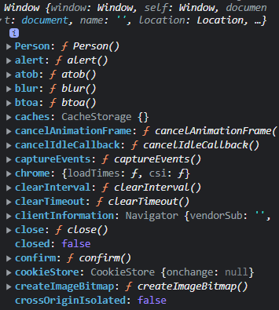
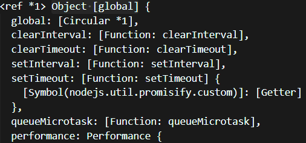
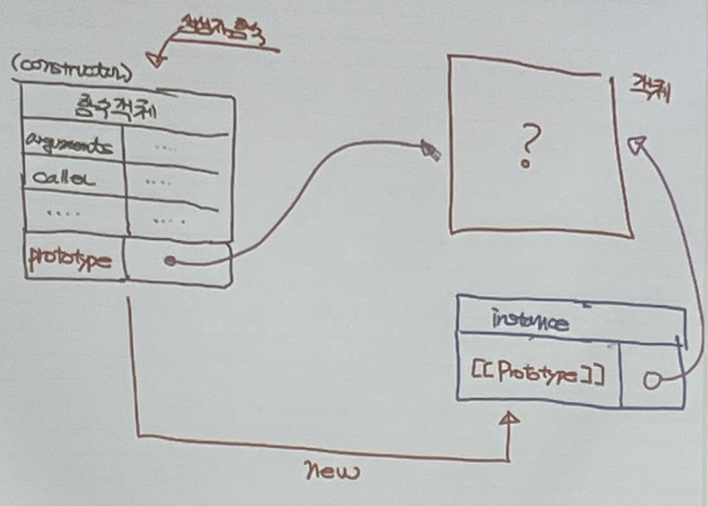
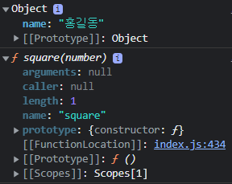

-복습-

# 객체
## JS 객체 생성 방법 : 4가지
- 객체 생성 방법에 따라 형태가 달라짐
    - 객체 Literal
    - Object 생성자 함수 (JS 내장함수)
    - 사용자 정의 생성자 함수
    - Object create() method
    - 'ES6' class

## 객체를 사용하는 방법
- . (dot notation)
- [ ] (bracket notation)


### 만약 property key가 JS identifier naming rule에 부합하면<br/>객체 literal을 이용할 때 따옴표('') 생략 가능

## 간단한 객체 literal
```
var age = 20;

var obj = {
    name: '홍길동'
    getName: function() {   // 메서드(실제 메서드는 아니다!, 메서드로 취급)
        console.log("getName");
    }
    setName() { // JS의 메서드(ES6에서 도입됨)
        ...
    }
    // age: age;
    age // property 생성 축약표현
}
```
JS 함수는 함수의 이름으로 호출되지 않고 식별자로 호출됨 => 익명 함수가 많이 사용됨

<br />

## Primitive Value vs Reference(Object)
- Primitive
    - immutable

- Reference
    - mutable (메모리 효율성, 객체를 복사할 때마다 메모리가 큰 객체를 할당할 공간을 만들어야 하고, 객체를 삭제할 때 가비지 컬렉터가 큰 메모리를 청소해야 하기 때문에 시스템 부하가 커짐)

<br />

## Property attribute
### [ [ &nbsp; ] ]
- 내부 slot
- 내부 method


<br /><br /><br />

# Function
<ol>
<br />

## 구성요소
<li>parameter(= 형식 인자, formal parameter / 지역변수임) : 실제 인자가 함수로 전달되었을 때 할당할 변수</li>
<li>argument(= 실인자, 인수, actual parameter) : 함수에 전달하는 값</li>
<li>return value : 함수를 호출한 곳으로 함수의 결과값을 전달</li>
</ol>

<br />

## Function literal
: 함수를 표현하기 위한 형식
```
function functionName(parameter...) {
    ...
}
```
- literal은 JS 엔진에 의해 해석되면 하나의 값을 반환하는데, 함수도 마찬가지이다.<br />
=> 따라서 함수를 변수(식별자)에 assign할 수 있음

<br />

## Function definition

<ol>
<li>함수 선언문</li> : 독립적으로 생성됨 (리터럴은 값으로 반환되는데 함수 선언문은 statement이기 때문에 변수에 할당하지 않고 독립적으로 존재)

```
function add(x, y) {
    return x + y;
}
```
<li>함수 표현식</li>

```
var myFunc = function(x, y) {
    retuurn x + y
}
```
<li>Function 생성자 함수</li> : 상속을 위해 만들어짐 (권장 XXXX)

```
var add = new Function('x', 'y', 'return x + y');
```
&nbsp; 함수 객체&nbsp; &nbsp; &nbsp; &nbsp; &nbsp; &nbsp; &nbsp; &nbsp; &nbsp; &nbsp; &nbsp; &nbsp; &nbsp; &nbsp; &nbsp; &nbsp; parameter &nbsp; &nbsp; &nbsp; 함수 실행 코드

<li>'ES6' 화살표 함수(Arrow Function)</li>

```
var add = (x, y) => x + y;
```

<li>'ES6' 함수 축약법(method)</li>
</ol>

## Function 실행,,?
- creation phase
- execution phase
- 선언문 : runtime 전에 함수의 식별자가 만들어짐과 동시에 함수 객체가 생성되어 식별자에 함수 객체가 assign된다.
- 함수 표현식 : runtime 전에 함수의 식별자가 context에 올라가고, runtime 때 함수 객체가 생성되어 식별자에 assign된다.

<br />

## Function invoke
- 함수 내부에 arguments(유사 배열 객체)가 있어 argument들을 저장

#### IIFE (즉시실행 함수)
- 함수 선언과 동시에 호출 => 전역변수 사용을 지양

#### 중첩 함수
- 함수 내에 함수가 존재하는 것

#### Callback 함수
- 고차함수(Higher-ordered function) : callback 함수를 사용하는 함수
- 함수가 일급 객체이기 때문에 함수의 인자로 전달할 수 있음
- 주로 event 처리나 Ajax에 사용


## Scope
- 동적 scope : 함수가 호출된 위치를 기준으로 scope 설정 => Dynamic scope
- 정적 scope : 선언한 위치를 기준으로 scope 설정 => Lexical scope(대부분의 언어가 Lexical scope를 따른다.)

<br /><br /><br />

---
---
---

<br /><br /><br />

# Object (객체)
<ol>
<li>확장금지 (Object preventExtensions()) -> property 추가 불가능</li>
<li>밀봉 (Object seal()) -> property의 추가와 삭제 불가능</li>
<li>동결 (Object.freeze()) -> property의 추가 삭제 &amp; property 값의 변경 불가능</li>
</ol>

## JS 객체를 자유롭게
- property의 추가
- property의 삭제
- property 값의 read
- property 값의 write

<br />

### Object 생성

- 객체 literal을 이용한 객체 생성
    ```
    const person = {};
    person.name = 'person';
    console.dir(person);
    ```
- 생성자 함수를 이용한 객체 생성
=> instance
    - new keyword를 이용해서 생성자 함수 호출
    - 대표적인 생성자 함수(built-in) : Object(), String(), Number(), Boolean(), Function(), Array()
        - 생성자 함수와 일반 함수의 차이는 없다. 생성자 함수로 사용할 때에는 new 키워드를 붙여 사용하면 된다. 그러나 사용 시 혼란이 생길 수 있으므로 생성자 함수의 이름을 대문자로 시작하여 생성자 함수라 표시한다.
    ```
    const person = new Object();
    person.name = 'person';
    console.dir(person);
    ```
- (User define) 생성자 함수
    - 이름 식별자 : PascalCase

        ```
        function Person() {
            // this
            // this라는 keyword는 생성자 함수일 경우도 있고
            // 일반 함수인 경우에도 있음
            // 생성자 함수에서의 this : 생성자 함수에 의해 만들어질 instance
            // 일반함수에서의 this : window

            console.log(this);
        }

        const person1 = Person();
        console.log(person1);    // undefined : 함수의 반환값이 없기 때문에

        const person2 = new Person();
        console.log(person2);   // Person {} (= this)
        // 생성자 함수는 return 구문을 사용하지 않는다. 자동으로 객체를 생성하고 this에 바인딩하여 반환

        const person3 = {};
        console.log(person3);   // {}
        ```
        - 생성자 함수를 'new' keyword로 호출 => instance
        
        <br />

        #### 생성자 함수의 return
        - 생성자 함수가 객체를 return하면 변수에 return된 객체가 바인딩된다.
        - 생성자 함수가 객체가 아닌 값을 return하면 정상적으로 객체가 생성되어 바인딩된다.
        - 따라서 생성자 함수에는 return 문을 쓰지 않는 것을 권장

### this
- this라는 keyword는 생성자 함수일 경우도 있고
- 일반 함수인 경우에도 있음
    - 생성자 함수에서의 this : 생성자 함수에 의해 만들어질 instance
    - 일반함수에서의 this : window
    - 메서드에서의 this : 
<br/>
<br/>

### Javascript Engine이 코드를 실행하기 위해 작동
<ol>
<li>built-in 객체(생성자 함수 포함) 생성</li>
<li>실행 환경에 맞는 global 객체를 생성<br />
    - browser 환경 : window<br />
    &nbsp; &nbsp; - 사용자가 생성한 객체들은 모두 window의 property가 됨<br /><br />
    &nbsp;&nbsp;&nbsp;&nbsp;<br /><br />
    - node.js 환경 : global<br />
    &nbsp;&nbsp;&nbsp;&nbsp;<br /><br />
</li>
</ol>

- 일반 객체는 호출(call, invoke) 불가능
- 함수 객체는 호출 가능 => 이 기능을 위해 함수 객체는 내부 slot, 내부 method를 가지고 있음 (Callable Object)
    - [[Call]] : 함수를 호출하면 JS Engine에 의해 call 내부 메서드가 호출됨
    - [[Constructor]] : 함수 객체를 통해 객체가 생성될 때 constructor 내부 메서드가 호출됨

<ol>
<li>함수 선언문</li>
<li>함수 표현식</li>
<li>Function 생성자 함수</li>
<li>'ES6' 화살표 함수(Arrow Function)</li>
<li>'ES6' 함수 축약법(method)</li>
</ol>

- 1 ~ 3) [[constructor]] 내부 메서드를 가지는 함수 객체 -> constructor => instance 생성 (생성자 함수)
- 4, 5) [[constructor]] 내부 메서드가 없는 함수 객체 -> non-constructor => instance 생성 불가 (생성자 함수가 아니다.)


********************************
다시 듣기 : 0706-4 20분<br />
## 함수 객체의 Property
- 일반 객체와 비교하여 더 가지고 있는 property
    - arguments property : arguments 유사 배열 객체를 property의 value로 갖는다. (함수 내에서 지역변수처럼 사용)
    - caller property: 비표준, 함수 자신을 호출한 함수에 대한 reference
    - length property: parameter의 개수
    - name property: 함수의 이름
    - prototype property: 해당 함수(생성자 함수)가 생성하는 instance가 내부 슬롯 [ [ Prototype ] ]으로 참조하는 객체를 가리킨다.
        - 함수 중 constructor 함수만 가지는 property(함수 선언문, 함수 표현식, class)
        
********************************
<br /><br /><br />
# 프로토 타입

```
var obj = {
    name: '홍길동'
}
console.dir(obj);

function square(number) {
    return number* number;
}
console.dir(square);
```
<!--  -->
<strong>!!! 모든 객체는 내부 슬롯 [[Prototype]] 을 가지고 있음 !!! <br /></strong>

Javascript Engine이 동작
1) built-in 객체 생성(Object, String, ...)
2) 전역객체 생성(window)
3) creation phase : 런타임 전 코드를 훑음
    - var 또는 사용자 정의 (생성자 함수) 객체의 식별자를 발견하면 전역객체의 property에 추가
    - 함수가 선언되어있을 경우, 함수 식별자가 전역객체의 property로 저장됨
    - 그 property의 value는 함수를 가리키는 함수의 주소
    - let, const 변수는 전역객체의 property에 추가되지 않음
    
<br />

```
function Person(name) {
    // 생성자 함수로 만들어질 instance가 가지는 property를 설정
    this.name = name;
}
```
- 함수 객체가 생성되면 그 함수의 prototype 객체가 함께 생성된다.
- 함수 객체의 prototype property는 prototype 객체를 참조한다.

<br /><br />

<strong>함수 객체 'Person'</strong>
|property key|property value| 
|:------:|:---:|
|arguments|인자를 담은 유사 객체 배열|
|caller|함수 자신을 호출한 함수에 대한 reference|
|length|parameter 개수|
|name|함수 이름|
|[[Prototype]]||
|prototype|Person(생성자 함수 객체)의 prototype 객체 참조|

<br /><br />

<strong>생성자 함수로 만든 instance 객체 'person1'</strong>
|property key|property value| 
|:---:|:--:|
|name|'홍길동'|
|[[Prototype]]|Person(생성자 함수 객체)의 prototype 객체 참조|
|\_\_proto\_\_|Person(생성자 함수 객체)의 prototype 객체 참조|

<br />

<strong>생성자 함수로 만든 instance 객체 'person2'</strong>
|property key|property value| 
|:---:|:--:|
|name|'홍길동'|
|[[Prototype]]|Person(생성자 함수 객체)의 prototype 객체 참조|
|\_\_proto\_\_|Person(생성자 함수 객체)의 prototype 객체 참조|

<br /><br />

<strong>'Person'(생성자 함수 객체)의 prototype 객체</strong>
|property key|property value| 
|:---:|:--:|
|[[Prototype]]|Person(생성자 함수 객체)의 prototype 객체 참조|
|constructor|Person(생성자 함수 객체)|

<br />
<br />


[[Prototype]]의 목적 : 상속 chain을 구성하기 위해

```
// 생성자 함수
function Circle(radius) {
    this.radius = radius;
    this.getDiameter = function() {
        return 2 * radius;
    }
}

const circle1 = new Circle(5);
const circle2 = new Circle(10);

console.log(circle1.getDiameter === circle2.getDiameter);   
// false : 함수 객체가 두 개 만들어 짐 => 메모리 낭비
```

<br />

- Java : 클래스 기반의 상속
- JS : prototype 객체 기반의 상속
    - JS는 상속할 공통 property를 prototype에 저장한다.
        ```
        function Circle(radius) {
            this.radius = radius;
            Circle.prototype.getDiameter = function() {
                return 2 * this.radius;
            }
        }
        circle1 = new Circle(5);
        circle2 = new Circle(10);

        console.log(circle1.getDiameter === circle2.getDiameter);   // true 
        ```
## <strong>=> prototype은 상속(Inheritance)을 구현하기 위한 목적 (코드의 재사용성 향상) </strong>

<br />
<br />


```
function Circle(radius) {
    this.radius = radius;
    Circle.prototype.getDiameter = function() {
        return 2 * this.radius;
    };

    Circle.prototype.name = '홍길동';
}
circle1 = new Circle(5);
circle2 = new Circle(10);
console.log(circle1.name, circle2.name);    // 홍길동 홍길동

console.log(circle1.getDiameter === circle2.getDiameter);   // true 
console.log(circle1.name, circle2.name);    // 홍길동 아이유
// => circle2.name = '아이유'; 는 property를 바꾸는 것이 아니라 새로운 property를 추가한 것이다.

Circle.prototype.name = '아이유';
console.log(circle1.name, circle2.name);    // 아이유 아이유

circle1.__proto__.name = '김가나';
console.log(circle1.name, circle2.name);    // 김가나 김가나

function Square(width) {
    this.width = width;
}

console.log(Square.prototype);
console.log(circle1.name);
```

<br />

[[Prototype]] : (상위) prototype 객체 => 객체 생성 방법에 따라 종류가 달라짐

<br />
<br />


## Rest Parameter(ES6)
=> 가변인자함수를 만들 때 사용
- arguments (유사 배열 객체) 대신 사용
- Rest parameter는 Array로 사용
- ... 으로 표현
- 항상 가장 마지막 parameter로 사용
- rest parameter는 2개 이상 사용할 수 없음
- push와 pop 사용 가능 (유사 배열이 아니기 때문)
- 함수 내에서 rest parameter와 arguments를 함께 사용할 수 있음.
  <br />  단, arrow function에서는 arguments 사용 불가 (arrow function = rest parameter) 

```
function foo(param1, ...args) {
    console.log(arguments);
    // [Arguments] { '0': 1, '1': 2, '2': 3, '3': 4, '4': 5 }
    console.log(args);
    // [ 2, 3, 4, 5 ]
}

foo(1, 2, 3, 4, 5);
```