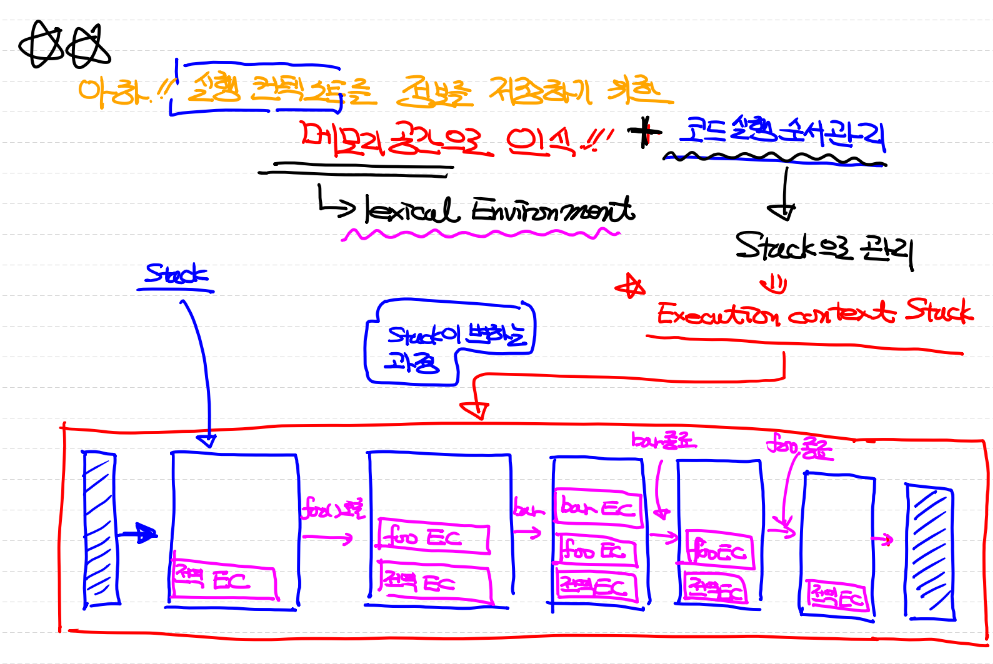

prototype 프로퍼티는 constructor 함수만 가지고 있음
constructor 프로퍼티는 constructor가 가리키는 prototype 객체만 가지고 있음

자바스크립트 엔진은 가장 먼저 global execution context(코드를 실행하기 위해 전역 객체, built-in 생성자 함수, 전역객체 등을 저장하기 위한 메모리 공간)을 할당하여 코드 실행에 필요한 모든 객체 등을 저장한다.

전역 실행 컨텍스트를 참조하여 코드를 실행

함수를 실행하면 함수 실행 컨텍스트가 따로 만들어져 전역 실행 컨텍스트와 link 되고,  함수 스코프 지정과 파라미터, 인수, 지역변수 등 함수와 관련된 정보들을 함수 실행 컨텍스트에 저장된다.

<br />
<br />

## "\_\_proto\_\_" 접근자 property
 : Object.prototype이 가지고 있는 property <br/>
- 모든 객체는 [[Prototype]] 내부 슬롯을 가지고 있지만 내부 슬롯에 접근 불가
- 대신 "\_\_proto\_\_" 라는 property로 접근 가능하게 만들어졌다.
    
        ```
        const obj = {};
        const parent = { x: 1 };

        obj.__proto__ = parent; // obj는 parent를 상속받을 수 있음
        console.log(obj.x); // 1
        ```
    <br />
- 만약 어떤 객체 또는 인스턴스의 상위 객체를 알고 싶다면 "\_\_proto\_\_"를 이용
    
    ```
    const obj = {};
    console.log(obj.__proto__.constructor.name);    // Object
    ```
    <br />
- 그러나 "\_\_proto\_\_" 표현이 코드에 직접 나오는 것은 권장되지 않음
    - 이유 : __proto__를 사용할 수 없는 경우가 있기 때문
       
        객체 생성 방법 <strong>Object.create()</strong> <br/>
        : 객체를 생성할 때 객체의 상위 prototype 객체를 직접 지정 가능
        ```
        const obj = Object.create(null);
        console.log(obj.__proto__); // undefined
        ```
        따라서 이러한 경우 Object의 메서드를 사용하는 것 권장
        ```
        console.log(Object.getPrototypeOf(obj));    // null
        ```

<br />

## prototype property : 'constructor'만 가질 수 있는 property
- constructor : 함수 선언문, 함수 표현식, class로 만들어진 함수
    - 따라서 일반 객체(literal)와 non-constructor(ES6의 arrow function, method)는 prototype property를 가지지 않음

<br />

## instance (person)
||소유|의미|
|---|---|---|
|\_\_proto\_\_|모든 객체(Object 상속)|prototype 객체의 참조|
|prototype|constructor|prototype 객체의 참조|

<br />

## 생성자 함수 (Person)
|Person 생성자 함수|||Person.prototype||
|---|---|---|---|---|
|prototype|Person.prototype||constructor|Person 생성자 함수|
|\_\_proto\_\_|Function.prototype||\_\_proto\_\_|Object.prototype|

<br />

## 객체 literal로 생성된 Object의 상위 prototype 객체
```
var obj = { name: '홍길동' };
```
```
var obj = new Object();
obj.name = '홍길동';
```
|Object.prototype|||객체||
|---|---|---|---|---|
|constructor|Object 생성자 함수||name|'홍길동'|
||||[[Prototype]]|Object.prototype|

=> 결과는 똑같지만 생성 과정이 다르다.

<br />
<br />

## 정리!
```
var foo = function() {};
console.log(foo.__proto__ === Function.prototype);  // true
console.log(foo.prototype.__proto__ === Object.prototype);  // true
console.log(Object.prototype.__proto__);    // null
console.log(foo.constructor === Function);  // true
```

### 여러 객체들의 prototype
- { } 객체 literal : Object.prototype -> <strong>Object</strong>
- 함수 literal : Function.prototype -> <strong>Function</strong>
- [1, 2, 3] 배열 literal : Array.prototype -> <strong>Array</strong>

### prototype 객체가 생성되는 시기
: 생성자 함수와 함께 생성됨

<br />

## JS Built-in (전역)함수
JS Engine의 작동이 시작되면 생성되는 함수
- Object
- Function
- Array
- Number
- String
---
- Math
- JSON
    - Math, JSON은 non-constructor이므로 생성자 함수가 아니다.
    - 정적 메서드를 통해 여러 함수 기능을 제공
    
JS Engine이 작동되면 전역 객체(window 객체: 계층에서 최상위 객체)가 생성되고, built-in 함수 객체들은 전역 객체의 property로 등록된다.

<br />

## Overriding과 Property Shadowing
- 오버라이딩 : 상속받은 메서드를 재정의
- 만약 overriding이 발생하면 발생된 overriding에 의해 prototype method가 숨겨지는 현상을 property shadowing이 발생했다고 한다
 
```
function Person(name='default') {
    this.name = name;
}

Person.prototype.sayHello = function() {
    console.log(`안녕하세요. ${this.name}`);
};  // 프로토타입 메서드 (생성자 함수 객체의 프로토타입의 property로 붙는 메서드)
// 인스턴스 메서드 : 생성자 함수 내에 property로 만들어지는 메서드

const me = new Person('홍길동');
me.sayHello();  // 안녕하세요. 홍길동 (prototype property 메서드를 호출)
me.sayHello = function() {
    console.log(`Hello ${this.name}`);
};
me.sayHello();
```

## prototype 변경
- ```
  Person.prototype = {
      constructor: Person,    // 직접 constructor를 연결
      sayHello() {
          console.log('안녕하세요!');
      }
  };

  const me = new Person('홍길동');
  console.log(me.constructor === Object);;
  ```
- ```
  Person.prototype = {
      // constructor: Person,    // 직접 constructor를 연결 가능
      sayHello() {
          console.log('안녕하세요!');
      }
  };  

  const me = new Person('홍길동');  
  const parent = {
      sayHello() {
          console.log('안녕하세요!');
      }
  };  

  Object.setPrototypeOf(me, parent);    // prototype 객체를 변경할 수 있는 메서드
  // me의 prototype 객체를 parent로 설정
  console.log(me.__proto__.constructor === Person.prototype); // false
  ```

<br />
<br />

# Implicit global (묵시적 전역)
- 선언 없이 변수를 사용, 변경할 수 있다.
- but bad .. 
- strict mode로 해결 가능 (system적으로 차단하여 언어적 차원에서 사용하지 못하게 된다.)

## Strict mode
<ol>
<li>Strict mode는 일반적으로 전역에 좋지 않다.</li>
- 여러 개의 JS 파일이 하나의 전역공간을 공유하기 때문에 원하지 않는 파일에도 strict mode가 적용되는 상황이 발생한다. (일반 라이브러리들이 동작하지 않을 가능성) 
<li>일반적으로 즉시실행함수(IIFE)를 만들어 함수 내부에 선언하는 것이 일반적</li>
</ol>

```
function foo() {
    x = 10; // ReferenceError가 발생해야 상식과 부합!
}   // 묵시적(암묵적) 전역, implicit global => 전역변수화!

foo();
console.log(x); // 10
```

### Strict mode 사용 시 주의사항
<ol>
<li>Implicit global(묵시적 전역)을 사용할 수 없음</li>
<li>변수, 함수, 매개변수를 delete로 삭제할 수 없음</li>
<li>this의 의미가 달라짐</li>
- 원래 일반함수에서의 this -> window (전역 객체)<br />
-                    this -> undefined
</ol>

<br />

## Built-in Object
= Built-in 함수 (function)
= Built-in 전역함수

```
var obj = new Object();
var str = 'Hello';  // primitive value
                    // data type : string

str.toUpperCase();  // wrapper 객체 생성, 소멸
str.toLowerCase();  // wrapper 객체 생성, 소멸
// 객체의 생성과 소멸이 반복되기 때문에 literal

var strObj = new String('홍길동');
'Hello'.toUpperCase();  // primitive value에 메서드 호출 (원래는 에러)
// 그러나 JS 엔진은 wrapper 객체(new String('Hello'))를 묵시적으로 만든다.
// wrapper 객체(유사 배열 객체)는 String().prototype의 상속을 받기 때문에
// String.prototype의 메서드를 사용할 수 있다.
// 근데 String.prototype의 [[Prototype]]은 Object.prototype임

// console.log(typeof strObj); // object
console.dir(strObj);    // 유사 배열 객체 (wrapper 객체)
```

## 전역 객체 (사용하는 platform에 따라 다름)
    - window (브라우저 환경)
    - global (node 환경)
=> globalthis (ES11)
- 개발자가 의도적으로 생성할 수 없음
- 브라우저 환경에서는 window (DOM, BOM, XMLHttpRequest, var로 선언된 전역변수, 묵시적 전역, NaN, undefined)

---


<br />
<br />

# Closure (클로저)
- closure는 JS 고유의 개념은 아니다. (함수형 프로그래밍 언어에서 사용되는 개념)

## First-class citizen(object)에 대한 이해
<ol>
<li>익명(동적)으로 생성 가능(runtime에 생성 가능)</li>
<li>값으로 변수나 자료구조에 저장이 가능</li>
<li>함수의 매개변수로 전달 가능</li>
<li>함수의 return 값으로 사용 가능</li>
</ol>
=> JS Function(함수)는 객체 취급 -> 일급객체 취급

## Closure 간단한 정의
- MSN : Closure는 함수와 그 함수가 선언된 lexical Environment(환경)의 조합

### Execution Context (실행 컨텍스트) like memory space
- 전역 실행 컨텍스트는 하나
- 각각의 함수마다 실행 컨텍스트가 만들어진다. (scope마다 관리해주어야 함)


#### ECMAScript 명세 (4가지 종류의 코드)
<ol>
<li>전역 코드 : 전역에 존재하는 소스코드. 전역 함수의 내부 코드는 포함되지 않음</li>
<li>함수 코드 : 함수 내부에 있는 소스코드. 중첩 함수의 내부 코드는 포함하지 않음</li>
<li>eval 코드</li>
<li>모듈 코드</li>
</ol>

- 소스코드가 존재하는 scope에 따라 실행 컨텍스트가 별도로 생성되고 관리되기 때문에 명세가 나뉘어짐

```
var obj = {};

function myFunc() {
    console.log('Hello');   // 함수 코드

    function sayHello() {   // myFunc의 함수 코드
        // nested function (inner function, 중첩 함수)    
        console.log('하이');    // sayHello의 함수 코드
    }
}

myFunc();   // 전역 코드
```

<br />

### 전역 코드
- 전역 코드가 실행되면 전역 변수를 관리하기 위해 <strong>전역 scope</strong> 생성, <strong>전역 var keyword</strong>로 선언된 식별자를 찾아 window 객체 생성하여 식별자를 window 객체에 바인딩(property로 지정)

=> 이러한 작업을 위해 전역 실행 컨텍스트를 생성

<br />

### 함수 코드
- 함수 내부에서 사용하는 지역변수, 매개변수, arguments 관리하기 위한 공간(local scope) 생성하여 이 스코프를 전역 스코프와 연결(Scope chain 생성)

=> 이러한 작업을 위해 함수 실행 컨텍스트를 생성

### 🌟🌟 실행컨텍스트는 정보를 저장하기 위한 메모리 공간(이게 바로 !! Lexical Environment) 으로 인식! <br />+ 코드 실행 순서 관리(Execution context stack으로 관리)

- 코드 실행 순서 관리 예시

```
const x = 1;

function foo() {
    const y = 2;
    function bar() {
        const z = 3;
        console.log(x + y + z);
    }
    bar();
}
foo();
```

<br />

## Lexical Environment와 Closure 예시

```
// 클로저 예시

const x = 1;

function outer() {
    const x = 10;

    const inner = function() {
        console.log(x);
    }
    return inner;
}

const innerFunc = outer();
innerFunc();

// innerFunc()가 호출되면 outer()가 호출되는데 inner가 return되면 지역변수 x=10, inner 함수는 사라져야 한다.
// 그러나 지역변수가 사라지지 않고 남아있어 innerFunc를 실행하면 10이 출력된다.
// 가비지컬렉터 : 메모리를 효율적으로 사용하기 위해 어떤 데이터를 아무도 참조하지 않으면 이 데이터를 삭제한다.
// inner 함수에서 x를 호출하면 이 x는 상위에 존재하는 (lexical) x의 value인 10을 출력하는데,
// inner 함수가 return 되어 innerFunc가 inner 함수를 참조하게 된다.
// 따라서 x와 inner의 참조가 아직 남아있기 때문에 가비지 컬렉션이 수행되지 않고 함수의 실행 컨텍스트가 종료되어도 
// 데이터가 삭제되지 않음
```
<ol>
<li>closure는 중첩 함수이다.</li>
<li>이 중첩 함수가 외부 함수의 결과값으로 return되어야 한다.</li>
<li>return되는 중첩 함수가 외부 함수의 식별자를 참조해야 한다.</li>
<li>return되는 중첩 함수의 life cycle(생명주기)가 외부함수보다 길어야 한다.</li>
<li>이때 중첩 함수에서 외부 함수에 대한 참조가 남아있기 때문에 <br/>
외부 함수의 실행은 execution context stack에서 제거되지만 lexical 환경은 메모리에 남아있기 때문에 중첩 함수에 의해 사용될 수 있는 현상</li>
</ol>
<br/>
<br/>

```
function foo() {
    const x = 1;
    const y = 2;
    function bar() {    // 외부 함수의 식별자를 참조하지 않은 상태(3)
        const z = 3;
        console.log(z);
    }
    return bar;
}
const bar = foo();  // 중첩함수가 외부함수의 결과값으로 return되고 있지만 클로저는 아님
bar();
```
```
function foo() {    // 중첩함수가 return 되지 않고(2), 생명 주기가 외부 함수보다 짧다(4).
    const x = 1;
    const y = 2;

    function bar() {
        console.log(x);
    }
    bar();
}

foo();
```

<br />
<br />

## Closure로 private 변수를 만드는 방법 (infomation hiding)
```
const increase = function() {
    let num = 0;
    return ++num;
}
console.log(increase());
console.log(increase());
console.log(increase());

const increase = (function() {
    let num = 0;
    return function() {
        return ++num;
    }
}());
console.log(increase());
console.log(increase());
console.log(increase());
```

```
const counter = (function() {
    let num = 0;
    return {    // 함수가 포함된 것을 return하면 클로저 생성 가능
        increase() {    // 메서드1
            return ++num;
        },
        decrease() {    // 메서드2
            return --num;
        }
    };
}());

console.log(counter.increase());    // 1
console.log(counter.increase());    // 2
console.log(counter.increase());    // 3
console.log(counter.decrease());    // 2
console.log(counter.decrease());    // 1
```