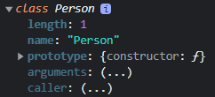

Javascript Class => 문법적 설탕 (???)

# programming 패러다임 -> 프로그래밍 방법론
- 객체 지향
- 함수형 -> 구조적, 절차적 프로그래밍
- 선언적 프로그래밍

JS : 멀티 패러다임 언어

<br>

## 구조적 프로그램(절차적) -> C 언어
- 장점
    <ol>
    <li>프로그램을 기능적으로 세분화</li>
    <li>기능을 모듈화 -> function(함수)</li>
    => 프로그램을 쉽고 빠르게 구현 (설계가 비교적 간단)
    </ol>

- 단점
    
    - 유지보수 어려움
    : 단위 기능을 모듈화하여 여러 부분에서 기능을 사용할 수 있지만 기능을 수정하면 이 기능을 사용하는 모든 곳에서 바뀐 기능을 사용하게 된다.
- 객체지향 개념이 생겨나게 되고 그 방식으로 프로그램을 구현할 수 있는 프로그래밍 언어들이 등장
    
    - Java (객체지향 개념을 가장 잘 대변)

=> 유지보수성
- 프로그램을 기능으로 세분화하지 않음
    - 현실세계의 문제를 program적으로 표현(modeling)
    - 문제를 구성하는 구성요소를 파악 -> 그 구성요소 간의 data 교환을 분석하여 프로그램으로 묘사
- 현실세계의 복잡한 부분을 추상화(단순화)하여 필요한 구성요소(상태와 행위)를 정의
    - 상태 : 변수 (값) -> 자바(field, 필드)
    - 행위 : 함수 (작동) -> 자바(method, 메서드)

<br>


# Class
- Class란 현실세계의 객체를 프로그래밍적으로 구현하기 위해 설계(modeling)하는 수단
- 객체를 프로그램 상에 구현한 instance를 만드는 도구
- ADT(Abstract Data Type) : 

- Javascript -> prototype 기반의 객체지향, 객체기반 언어<br>
=> class가 필요 없지만 ES6에서 <strong>class</strong>를 도입

<br>

## Javascript class의 특징 (생성자 함수와 유사)
- class는 함수이면서 객체임 (함수 객체)
    - class를 통해 instance 생성 가능
<ol>
<li>class는 반드시 "new" keyword와 함께 사용</li>
<li>class 간의 상속 지원 -> "extends", "super" keyword 사용</li>
<li>class 역시 hoisting이 발생(but TDZ가 존재하기 때문에 초기화 이전에는 사용할 수 없음)</li>

```
const Person = '안녕하세요';

{
    console.log(Person);
    class Person {}
}
```

<li>class 내부 코드는 기본적으로 strict mode로 동작됨</li>
<li>class 안에는 'constructor'(class 내에 단축형태로 사용되는 js 함수), 'prototype 메소드'(prototype property가 되어 instance에게 상속되는 메서드), 'static 메서드'만 있다.</li>
-> 이 property의 property attribute (writable, enumerable, configrable) 값는 모두 false🌟

```
class Person {
    // constructor, 생성자
    constructor(name) {
        // instance의 초기화
        // instance의 property를 설정
        this.name = name;   
        // 생성자가 실행되면 만들어질 instance의 property에 name을 추가하여 값을 넣어준다.
    }
    // prototype method : prototype 객체가 가지고 있는 method
    // instance에 상속되는 method
    protoMtd() {
        console.log('prototype method');
    }

    // static method
    static staticMtd() {
        console.log('static method');
    }
}

const me = new Person('홍길동');
console.log(me);
```
</ol>


### class define
```
class Person {

}
```
- class는 일급객체이기 때문에 변수에 assign할 수 있다.
    ```
    // 익명 class 표현식
    const Person = class {};

    // 기명 class 표현식
    const Person2 = class MyClass {};
    ```
- class는 0개 이상의 method 구성 (ES6 축약표현으로 만들어진 method -> non-constructor)

<br>

### class 구성요소
<ol>
<li>constructor method(생성자)</li>

- instance의 초기화 담당
- 하나만 존재. 여러 개일 수 없음! (오버로딩의 개념이 없기 때문)
- 없으면 JS Engine이 default constructor를 생성
<li>prototype method</li>
<li>static method</li>

```
class Person {
    // constructor, 생성자
    constructor(name) {
        // instance의 초기화
        // instance의 property를 설정
        this.name = name;   
        // 생성자가 실행되면 만들어질 instance의 property에 name을 추가하여 값을 넣어준다.
    }

    // prototype method : prototype 객체가 가지고 있는 method
    // instance에 상속되는 method
    protoMtd() {
        console.log('prototype method');
    }

    // static method
    static staticMtd() {
        console.log('static method');
    }
}
```
</ol>

- class 역시 hoisting이 발생
- new keyword로 instance를 생성 -> class 이름이 아니라 식별자로 사용
    - instance가 실제 만들어지는 함수는 constructor
    ```
    class Person {
        constructor(name) {
            this.name = name;
        }
    }

    const me = new Person('홍길동');
    console.dir(me);
    console.dir(Person);
    ```
    

    - 클래스는 함수이자 생성자 함수이다.

#### constructor는
    - 2개 이상 존재할 수 없음
    - 생략 가능 (엔진에 의해 자동으로 생성 : 인자가 없고 기능이 없는 constructor)
    - return 구문 사용 x (묵시적으로 this를 return)

#### 접근자 property
- property임에도 불구하고 [[value]]를 가지고 있지 않음
    
    -> 일반적으로 다른 property의 값을 읽어오거나(getter) 저장(setter)할 때 사용
- get, set keyword 사용
    - get
    - set

```
// 객체 literal을 이용해 객체 생성
class Person {
    constructor(firstName, lastName) {
        this.firstName = firstName;
        this.lastName = lastName;
    }
    get fullName() {    // 접근자 property (get 키워드, 축약형, return 필요)
        return `${this.lastName}${this.firstName}`
    }
    set fullName(name) {
        // 유효성 검사
        [this.lastName, this.firstName] = name.split(' ');
    }
};

const me = new Person('길동', '홍');
console.log(me.fullName);   // 홍길동
me.fullName = '김 연아';
console.log(me.fullName);   // 김연아
```

# 상속
부모 클래스 : super class<br>
자식 클래스 : sub class
- 상속 관계인 두 클래스의 관계를 is-a relationship이 성립
    - subclass is a superclass (o)
    - superclass is a subclass (x) : 역은 성립하지 않음<br>
=> sub class와 super class의 데이터 타입은 서로 다르지만 상속 관계로 인해 is-a relationship이 성립되면 sub class는 super class의 데이터 타입을 사용할 수 있다. (polymorphism, 다형성)

## 상속에 따른 class 확장
prototype 기반 상속과는 다름
- class 상속은 extends를 이용
-> 하위 class에 [[Prototype]]에 이어진게 상위 class

- instance를 만들면 가장 상위 super 클래스의 constructor가 호출되어야 한다. 그러나 constructor는 명시적으로 호출할 수 없기 때문에 super() 라는 함수를 호출하면 된다.

```
// super class
class Animal {
    constructor(age, weight) {
        this.age = age;
        this.weight = weight;
    }

    eat() {
        return 'eat';
    }

    move() {
        return 'move';
    }
}

class Bird extends Animal {
    constructor(age, weight, kk) {
        this.kk = kk;
        super(age, weight); // 에러가 발생할 것임
    }
}

const bird = new Bird();
```
- 위의 코드는 에러가 발생할 것이다. 왜냐하면 instance가 생성되기 전에 kk라는 property를 설정하려 하기 때문이다. super()를 먼저 호출하여 instance를 생성하고, 그 instance를 this로 받아 kk property를 부여해야 한다.

```
class Animal {
    constructor(age, weight) {
        this.age = age;
        this.weight = weight;
    }

    eat() {
        return 'eat';
    }

    move() {
        return 'move';
    }
}

class Bird extends Animal {
    constructor(age, weight, kk) {
        // 상위 클래스의 cocnstructor 호출
        super(age, weight); 
        this.kk = kk;
    }
    fly() {
        return 'fly';
    }
}

const bird = new Bird(10, 30, 100);
console.log(bird);
console.log(bird instanceof Bird);  // true
console.log(bird instanceof Animal);    // true
```
- bird는 Bird의 instance이므로 Animal의 instance이기도 하다. (is-a relationship)


## class 간 상속
- 생성자 함수 간 상속은 불가능
- class와 생성자 함수는 상속 관계를 가질 수 있음
=> class는 생성자 함수로부터 상속을 받을 수 있음

    ```
    function Base(name) {
        this.name = name;
    }

    class Derived extends Base {
        
    }
    ```

- 동적 상속 허용
    - extends 키워드 뒤에 값으로 평가될 수 있는 식이 올 수 있음
    
    ```
    function Base1(name) {
    this.name = name;
    }

    class Base2 {

    }

    let tmp = true;
    class Derived extends (tmp ? Base1 : Base2) {

    }
    ```

# Array
- 가장 대표적으로 많이 사용하는 자료구조 -> 활용 빈도가 매우 높음

## array literal -> [ ]

```
const arr = [1, 2, 3]   // array literal
```
```
const arr = new Array();
```

- 배열의 요소
    - element(요소, 원소)
    - 숫자 index로 배열 참조
- 배열은 javascript 객체 (Object)

<br>

|Object(객체)|배열(Array)|
|---|---|
|property key|index|
|property value|요소(element)|
|순서가 없음|순서가 있음|
|length X|length O|

## Data Structure 관점에서
- Array(배열)
<ol>
<li>연속적인 저장 공간</li>
<li>같은 data type을 가진 데이터들을 저장</li>
- 각 공간의 크기가 같음
</ol>
=> index를 이용해 직접 값에 access 가능, O(1)<br>
: 같은 크기의 저장공간이 연속적으로 존재하기 때문에 index를 통해 데이터의 위치를 빠르게 계산할 수 있다. (Dense Array, 밀집 배열)<br>
=> 삽입, 삭제 처리의 비용이 큼, O(n)

<br>

## Javascript 배열은
=> 일반적인 배열의 특징과는 반대이다.<br>
: 데이터와 데이터 사이에 빈 공간이 있어 삽입, 삭제 처리의 속도가 매우 빠르다. (Sparse Arrray, 회소 배열) <br>
그러나 데이터에 접근하는 속도는 느리다.