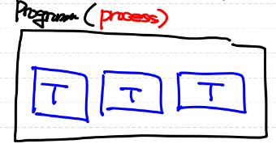
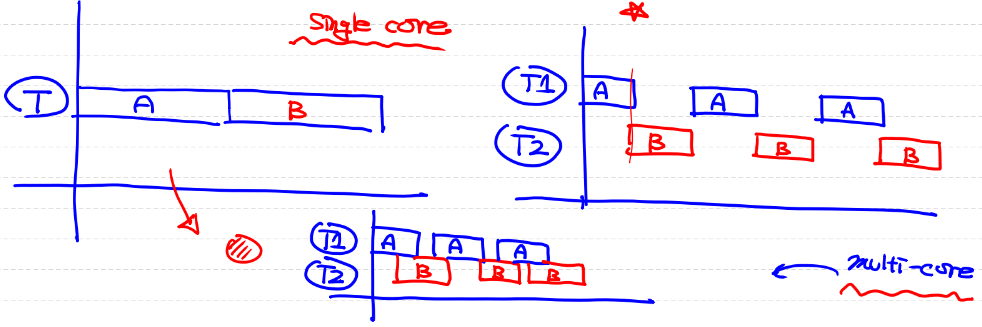
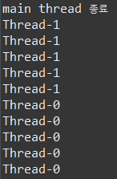
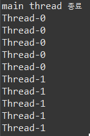
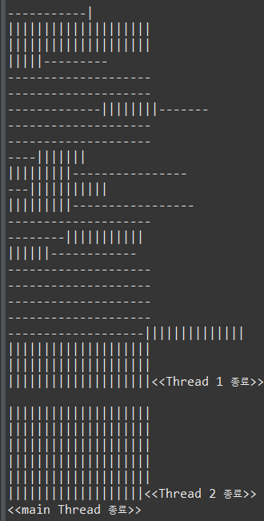
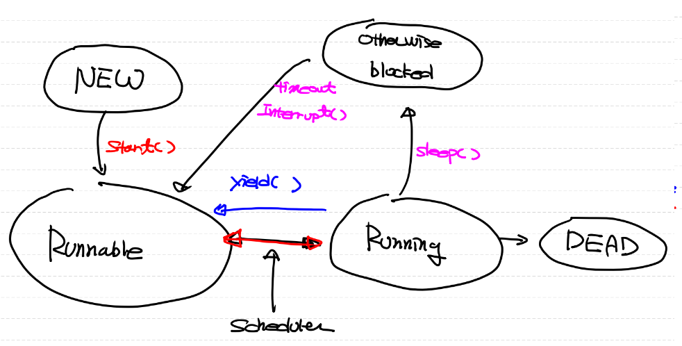

# Error
## Compile Time Error
- code 작성 error

<br>

## Runtime Error
- Error : 더 이상 프로그램이 지속될 수 없는 오류
- Exception : 해결 가능한 오류
    - Java에서는 error에 대한 해결 기능을 class로 정의
    - class들은 최상위 class인 Exception class를 상속

- 프로그램이 실행되다 중단(error)되면 JVM이 현재 오류 사항에 대한 정보를 모아 (Exception)instance를 생성한다.
- 이 객체를 우리가 프로그램적으로 처리
    - 잘 처리되면 강제종료 되지 않고 지속적인 실행 가능
    - 처리되지 않으면 프로그램이 강제종료

```
try {

} catch {

} finally {

}
```

<br>
<br>
<br>

# Thread
- Thread가 무엇인지?
- 중요한 용어, class와 method

독립적인 실행 흐름을 가지고 있다.

<br>
<br>

# Process
프로그램을 실행시키기 위해 OS로부터 resource를 할당받아야 한다.
<ol>
<li>Code : 프로그램 실행 코드</li>
<li>Data : 데이터</li>
<li>Heap</li>
<li>Stack</li>
</ol>

- 현재 실행중인 프로그램인 프로세스에는 최소 1개 이상의 thread가 존재
    - 1개 : Single-thread Process
    - 2개 이상 : Multi-thread Process

- Process = resource + thread
    - resource : code, data, stack, heap
    - thread : 여러 개, execution stack을 별도로 가지고 있는 실행 흐름

<br>


<br>
<br>
<br>

# CPU(core)
한 순간에 한 가지 일만 수행
## Multi tasking
- 만약 single core라면?
- 여러 프로그램이 동시에 실행되는 것처럼 보임 (email, powerpoint, game, music, ...)
    - time slicing(시분할) 
## Multi processing
- core가 2개 이상일 때에만 의미가 있음
- 여러 프로그램이 동시에 실행됨

<br>



# Multi-threading
- 장점 : 효율적인 처리, 응답속도가 빠름
- 단점 : 프로그램이 어려움 (공유자원에 대한 "동기화 처리" => Deadlock)

## Java에 Thread를 만들어 사용하는 방법
- JVM이 entry point이므로 JVM에서 main thread가 파생되어 이 thread가 main method를 호출
- Java에서 thread는 instance임
- main method가 아닌 다른 method는 해당 class(class Thread)로 생성 가능

<ol>
<li>Thread Class를 상속해 user define Thread class를 작성하여 instance를 만들어 사용</li>
- Java의 단일 상속 문제
- tightly coupled 문제

<li>Runnable interface을 구현한 user define class를 작성하여 instance를 만들어 사용</li>
- 상속 관계가 없어 1번의 문제를 해결 가능
</ol>

```
class MyThread extends Thread {
	@Override
	public void run() {
		System.out.println("Hello");
	}
}

public class Main {
	public static void main(String[] args) {
		MyThread t = new MyThread();
        t.run();
	}
}
```
Call Stack(1개의 thread)
1) main()
2) run()
run()을 직접 실행했기 때문에 별개로 실행되는 method가 아님

```
class MyThread extends Thread {
	@Override
	public void run() {
		System.out.println("Hello");
	}
}

public class Main {
	public static void main(String[] args) {
		MyThread t = new MyThread();
		t.start();
	}
}
```
main thread의 call stack
1) main()
2) start() -> t thread의 call stack 생성

t thread의 call stack
3) run()

4) start() 종료
5) main()과 run()이 별개의 thread에서 실행됨


```
class MyThread extends Thread {
	@Override
	public void run() {
		System.out.println("Hello");
	}
}

public class Main {
	public static void main(String[] args) {
		MyThread t = new MyThread();
		t.start();
		
		System.out.println("안녕하세요!");
	}
}
```
'Hello'와 '안녕하세요'가 출력되는 순서가 보장되지 않음


```
class MyThread extends Thread {
	@Override
	public void run() {
		System.out.println("Hello");
	}
}

class MyThread2 implements Runnable {
	@Override
	public void run() {
		// TODO Auto-generated method stub
		
	}
}
```
Runnable의 run()은 Runnable이 interface이므로 추상 메서드가 되기 때문에 필수적으로 override 해야 하지만 Thread의 run()은 상속받은 메서드이므로 override 선택 가능하다.

```
class MyThread extends Thread {
	@Override
	public void run() {
		System.out.println("Hello");
	}
}

class MyThread2 implements Runnable {
	@Override
	public void run() {
		System.out.println("이 또한 실행 가능!");
	}
}

public class Main {
	public static void main(String[] args) {
		MyThread t = new MyThread();
		t.start();

		MyThread2 a = new MyThread2();
		Thread t1 = new Thread(a);
		t1.start();
		
		System.out.println("안녕하세요!");
	}
}
```
Runnable interface를 구현한 class의 instance를 생성하여 Thread instance의 생성자로 전달하여 Thread 생성!





<br>

# Thread의 상태 전이도
new : Thread 객체 생성

객체.start() ->
Runnable : 실행 가능한 상태 (CPU에 의해 선택됨)로 대기

Thread Scheduler가 Runnable 상태의 Thread들 중 하나를 선택(알고리즘, 자료구조를 이용)
->
Running(CPU 점유) 
run() 수행 
- (전체를 다 수행하지 않고 Thread Scheduler가 메모리나 CPU 상황을 살핀 후 Thread에게 CPU를 할당하기 때문에 여러 Thread가 Running - Runnable 상태를 반복하여 변화)

Thread의 run()이 종료
- Running Completed 상태가 되면 Dead 상태가 됨 => 종료된 Thread는 다시 복구가 불가능, 새로운 Thread를 생성해 사용해야 함

## Process의 종료
내부에서 파생된 모든 user define thread가 종료되는 순간

<br>

# Single Thread
- Single Core일 경우
    - 속도 : single thread에서 작업이 더 빨리 끝남 (multi-thread에서는 context switching이 빈번하게 발생)
    - 동시성 : multi thread에서 더 동시 작업처럼 느껴짐
- Multi Core일 경우
    Multi Processing이 가능

<br>
<br>

# Demon Thread
```
t1.setDaemon(true);
```

- 다른 일반 Thread의 보조적인 작업을 위해 사용
- 해당 Thread를 파생시킨 Thread가 종료되면 함께 자동으로 종료됨 (명시적으로 종료시키지 않음)
- ex) Garbage Collection, Autosave, ...

<br>

```
public class ThreadExam02 implements Runnable {
	static boolean autoSave = false;
	
	public static void main(String[] args) {
		Thread t = new Thread(new ThreadExam02());
		t.setDaemon(true);	
        // main thread에서 생성된 daemon thread는 main thread가 종료되면 함께 종료됨
		// daemon thread로 지정되어 있지 않으면 무한반복됨 (thread가 종료되지 않기 때문)
		t.start();	// main thread, t thread가 시작됨
		
		for(int i = 0; i < 10; i++) {
			try {
				Thread.sleep(1000);	// static method "sleep()" : main thread를 재움
			} catch (Exception e) {
				
			}
			System.out.println(i);
			
			if(i == 5) {
				autoSave = true;
			}
		}
	}
	
	@Override
	public void run() {
		while(true) {
			
			try {
				Thread.sleep(3000);	// 해당 코드를 수행하는 thread를 재움
			} catch (InterruptedException e) {
				
			}
			
			if(autoSave) {
				System.out.println("자동저장 완료");
			}
		}
	}
}
```

<br>

# 기억해야 하는 Thread의 method
<ol>
<li>Sleep(long millisecond) : 일정 시간동안 thread를 중지시킴</li>

- 지정된 시간이 되었거나
- Thread에 대해 <strong>interrupt()</strong>가 호출되면 interruptedException이 발생(항상 try-catch문 필요)하면서
- Sleep() 메서드가 종료되며 깨어남

<br>

### Thread의 상태 전이도 (Sleep)

```
class ThreadExam03_1 extends Thread {
	public void run() {
		for(int i = 0; i < 300; i++) {
			System.out.print("-");
			if (i%20 == 0) {
				System.out.println();
			}
		}
		System.out.println("<<Thread 1 종료>>");
	}
}

class ThreadExam03_2 extends Thread {
	@Override
	public void run() {
		for(int i = 0; i < 300; i++) {
			System.out.print("|");
			if (i%20 == 0) {
				System.out.println();
			}
		}
		System.out.println("<<Thread 2 종료>>");
	}
}

public class ThreadExam03 {
	public static void main(String[] args) {
		ThreadExam03_1 t1 = new ThreadExam03_1();
		ThreadExam03_2 t2 = new ThreadExam03_2();

		t1.start();
		t2.start();
		
		try {
			t1.sleep(2000);
		} catch (Exception e) {
			
		}
		System.out.println("<<main Thread 종료>>");
	}
}
```
>> 실행결과


<li>interrupt() : thread 실행 후 작업이 끝나기 전에 (run() 메소드가 종료되기 전에) 해당 thread를 종료시키기 위해 사용</li> => stop() 대신!

- interrupt() 이용 -> 직접 중지시키지 않음, thread 내부 상태값인 "Interrupted state"를 변경 
<br>= 이 상태값을 확인하여 변경하는 logic을 작성해야 함

### thread가 interrupt 되었는지 확인
- interrupted() : Thread class의 static method(class method, 현재 method를 실행시킨 Thread)로 현재 Thread의 interrupted 상태값을 ture, false로 반환하고 상태값을 false로 변경
- isInterrupted() : Thread class의 method(instance method, 특정 Thread 지정 가능)로 특정 Thread의 interrupted 상태값만 true, false로 반환

<li>yield() : Thread가 자신에게 주어진 실행 시간을 다 쓰지않고 다른 Thread(Runnable 상태)에게 양보</li>
=> 프로그램의 응답성을 높이기 위해 사용

<br>

### "deprecated"된 method들
<li>stop() : Thread의 종료(강제)</li>
<li>suspend() : Thread의 일시중지</li>
<li>resume() : 일시중지된 Thread의 실행</li>

</ol>

<br>

# 멀티코어 프로세스
- core들이 memory에 저장된 변수에 접근하는 것이 비효율적이기 때문에 cache memory 공간을 따로 갖고 있음
- 각 core들은 변수에 접근할 때마다 memory 내에 변수에 접근하지 않고 cache 내에 저장된 변수에 접근하여 값을 얻어옴
- 따라서 core에게 cache가 아닌 memory에 직접 접근해야 한다고 알려주어야 함 (volatile)

```
class ThreadExam06_1 implements Runnable {

	volatile boolean suspended = false;
	volatile boolean stopped = false;
	
	
	@Override
	public void run() {
		while(!stopped) {
			if(!suspended) {
				System.out.println(Thread.currentThread().getName());
				try {
					Thread.sleep(1000);
				} catch (Exception e) {
					
				}
			}
		}
	}
	
	public void suspend() {
		suspended = true;
	}
	
	public void stop() {
		stopped = true;
	}
	
	public void resume() {
		suspended = false;
	}
}

public class ThreadExam06 {
	public static void main(String[] args) {
		ThreadExam06_1 r1 = new ThreadExam06_1();
		ThreadExam06_1 r2 = new ThreadExam06_1();
		ThreadExam06_1 r3 = new ThreadExam06_1();
		
		Thread t1 = new Thread(r1, "*");	// 두 번째 인자 : Thread의 이름
		Thread t2 = new Thread(r2, "**");
		Thread t3 = new Thread(r3, "***");

		t1.start();
		t2.start();
		t3.start();
		
		try {
			Thread.sleep(3000);	// main Thread 2초 sleep
			System.out.println("t1 일시중지");
			r1.suspend();	// t1 일시중지
			Thread.sleep(3000);
			System.out.println("t2 일시중지");
			r2.suspend();	// t2 일시중지
			Thread.sleep(3000);
			System.out.println("t1 다시 동작");
			r1.resume();	// t1을 다시 동작
			Thread.sleep(3000);
			System.out.println("t1 강제종료");
			r1.stop();
			System.out.println("t2 강제종료");
			r2.stop();
			Thread.sleep(3000);
			System.out.println("t3 강제종료");
			r3.stop();
		} catch (Exception e) {
			
		}
	}
}
```


<br>

```
@Override
	public void run() {
		while(!stopped) {	// busy waiting : 멈춰있는 것처럼 보이나 실제로는 계속해서 반복문을 실행하고 있음
			if(!suspended) {
				System.out.println(Thread.currentThread().getName());
				try {
					Thread.sleep(1000);
				} catch (Exception e) {
					
				}
			} else {
				Thread.yield(); // 따라서 CPU를 사용하지 않기 위해 다른 Thread에게 양보함
			}
		}
	}
```

- suspended = false(실행중)일 때 
    - busy waiting : 멈춰있는 것처럼 보이나 실제로는 계속해서 반복문을 실행하고 있음
- 따라서 suspended = true(일시정지)일 때
    - yield()를 호출하여 다른 Thread에게 자원을 양보

# 상태전이도

