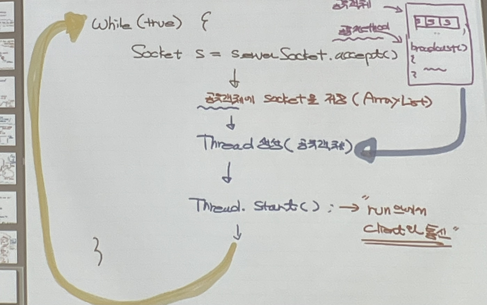

java
- Thread
- I/O
- Network -> 채팅 => 예제 2가지, 채팅 구현

<br>
<br>

---
---

<br>
<br>

# Internet
여러 개의 컴퓨터들을 물리적으로 연결하여 하나의 단위로 묶어 데이터 통신
``` Network of Network```


## Network (size로 분류)
1) LAN(Local Area Network)
2) WAN(Wide Area Network)
3) MAN(Metropolitan Area Network)

<br><br>

# 데이터 통신

- IP address는 NIC(Network Interface Card)에 할당되며, NIC에 MAC address가 지정되어 있음
- 따라서 데이터 통신을 위해서는 IP address를 알아야 함
- 통신에 지정된 방식으로 통신을 해야함 (Protocol)

<br>

## IP address
- 논리적(추상적)인 주소이기 때문에 고정되어 있지 않음

    -> MAC address (물리적 주소)
- IPv4 : 32bit 주소
- IPv6

<br>

## MAC address
- IP address ▶ MAC address (ARP)<br>
- 실제로는 NIC 간의 통신

<br>

## Protocol
데이터 통신을 위해 지켜야 할 규칙(통신 규약)

HTTP (HyperText Transfer Protocol), FTP (File Transfer Protocol), SMTP, TELNET, TCP/IP

<br>

## Port
- 숫자 0 ~ 65535를 사용
- 해당 컴퓨터에서 실행되고 있는 프로그램(프로세스)의 번호
- 데이터 통신을 위해 특정 프로세스에 접근하기 위해 부여한 번호
    - 0 ~ 1023 : 용도가 지정(reserved)된 port 번호
    - 1024 ~ : 사용 가능

<br>

## 컴퓨터의 프로그램 간 데이터 통신
1) IP 주소 (MAC 주소)
2) Port 번호
3) Protocol

<br><br>

# Socket
- network 하단의 복잡한 protocol에 상관없이 쉽게 프로그램을 작성할 수 있음
- 컴퓨터 프로그램 간 데이터 통신에 필요한 IP address, Port 번호, Protocol과 함께 Socket을 사용하여 쉬운 데이터 통신이 가능

<br>

### => Java에서의 네트워크(데이터) 통신 : Socket class 이용
- application 간의 데이터 통신 간편

<br>

## Socket은 CS 구조 (Client-Server)
- client는 능동적으로 접속
- server는 client의 접속을 기다림

1) client와 server에 각각의 Socket instance가 생성됨
    - Server 전용 Socket : Client의 접속을 기다리는 용도
2) Stream을 이용해 두 프로그램을 연결하는 통로 생성
    - Client : Output Stream (데이터를 보냄), Input Stream (server가 보낸 데이터를 받음)
    - Server : Input Stream (client의 데이터를 받음), Output Stream (데이터를 보냄)

<br>

## Socket 통신 준비
1) Server Process는 Client의 접속을 기다림, ServerSocket 생성
    - Client의 접속을 기다리면서 접속이 확인되면 해당 Client와 통신할 Socket을 생성하는 역할
2) Client Process는 ServerSocket에 접속을 시도하여 접근 가능한지 확인한 후 Socket을 생성
3) ServerSocket은 Client와 통신할 Socket을 생성
4) Stream을 생성하여 두 소켓을 Mapping 

<br>

### ✔ 연습문제 1. 
Server는 접속한 Client에게 현재 날짜를 전송

### ✔ 연습문제 2. Echo Program
client가 "/exit"라는 문자열을 입력하면 종료

### ✔ 연습문제 3. 
방 1개짜리 chatting program 구현
