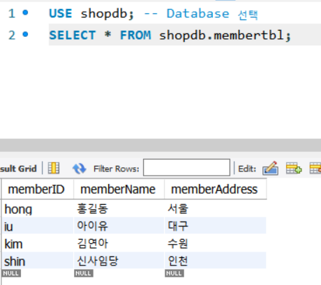
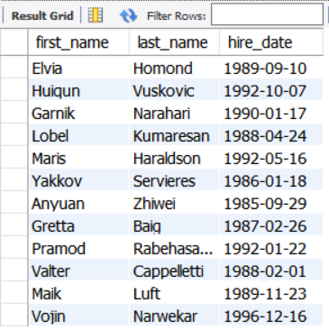
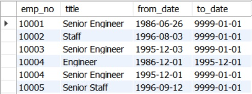

# Database
데이터의 집합
- 관련있는 대용량의 데이터 집합을 체계적으로 구성해놓은 것
- 사용자가 많음, 데이터 처리, 여러 개의 database 관리
▶ 이것을 위해 software가 필요 => DBMS (Database Management System)

<br> 

## DBMS
- MySQL : 교육용 - 무료, 상업용 - 유료
- MariaDB : 무료
- <strong>Oracle</strong> : 상용시장 점유율 1위
- DB2 : 메인 프레임 시장 1위 (IBM)
- SQL Server : (Microsoft)
- Postgres

<br>

### DBMS 특징
1) 🌟integrity (무결성) : 데이터의 오류가 있어서는 안된다.
- 제약 조건(constraints)을 이용하여 사용자가 잘못 사용해도 무결성 보장
2) 데이터의 독립성 : Database의 크기, 위치 등을 변경해도 기존에 사용하고 있는 software들은 영향을 받지 않아야 한다.
3) 보안
4) 중복의 최소화
5) 안정성(backup / restore)

### DBMS 종류
1) 계층형 database : 
2) 네트워크 database : 구현이 안됨
3) 🌟Relational database : IBM (E.F.coo) - 2차원 table로 구현된 DB
4) OO database : 객체지향
5) 객체-관계형 database : 🌟Oralcle🌟

<br>
<br>

## cmd

```
C:\Users\user>cd C:\Users\user\Downloads\employees
```

```
C:\Users\user\Downloads\employees>mysql -u root -p
```

```
mysql>show databases;
```


<br>

```
mysql> source employees.sql
```


<br><br>
---
---
<br><br>

## Table
- data를 저장하기 위한 표 형태의 구조 (relation)

## Primary key
- 각각의 row를 unique한 값으로 식별, 구분할 수 있는 column의 집합
- 지정 가능
- 해당 column에는 값이 무조건 있어야 하고, 중복 불가
- 인덱싱이 되기 때문에 데이터를 검색하는데 필요
- 한 개만 지정!
- 복합 키 : 여러 column으로 key 설정 가능

<br><br><br>

# mySQL : workbench
### Schema
: database 안에서 data의 구조, data의 표현방법, type, data의 관계를 특별한 형식 언어를 이용해 정의한 구조


- external schema : 
- conceptual schema : data의 논리적인 구조를 특정 형식으로 구현
- internal schema : data가 물리적으로 어떻게 저장되어 있는지(저장 구조, file system)에 대한 정보

MySQL(MariaDB)에서는 Schema = Database

<br><br>

## Schema 생성 (shopdb)

|열 이름(한글)|영문 이름|데이터 형식|길이|NULL 허용|
|---|---|---|---|---|
|아이디|memberID|문자(CHAR)|8글자(영문)|X|
|회원 이름|memberName|문자(CHAR)|5글자(한글)|X|
|주소|memberAddress|문자(CHAR)|20글자(한글)|O|

<br><br>


테이블을 이용할 때에는 Database를 명시해주어야 한다.

<br><br>

# DB 순서
1) Database 생성
2) Table 생성, data 입력
3) USE (database 선택)




<br><br><br>

# 실제 우리가 Datebase를 다루는 부분


## Index
- 가장 쉽게 사용하는 방법 : P.K (Primary key) 설정
▶ 해당 column에 index가 설정됨


```
-- TABLE 생성
CREATE TABLE indexTBL(
	first_name VARCHAR(14), 
    last_name VARCHAR(16),
    hire_date DATE
);
```

```
-- employees 테이블에서 500개의 데이터를 가져오기
INSERT INTO indexTBL
	SELECT first_name, last_name, hire_date
    FROM employees.employees
    LIMIT 500;
```


```
SELECT * FROM shopdb.indextbl;
```



<br>

```
-- first_name이 Mary인 사람을 찾아서 가져옴
SELECT * FROM shopdb.indextbl WHERE first_name = 'Mary';
```


```
SELECT * FROM shopdb.indextbl WHERE first_name = 'Mary';

CREATE INDEX idx_indexTBL_firstname	ON indexTBL (first_name); -- index 이름 설정
```


<br><br>

## View
- 가상의 table (실제로 data를 가지고 있지 않음)
    1) data를 안전하게 유지
    2) 보안적 측면
    3) 사용의 편리성
- 주로 ```SELECT``` 작업에 사용

```
CREATE VIEW v_memberTBL
AS
	SELECT memberName, memberAddress FROM memberTBL;
-- 가상의 table인 view를 만들고 memberTBL에서 데이터를 선택하여 그 안에 데이터를 넣음
```

<br><br>

## Stored Procedure (저장된 함수)
: 함수 interface를 제공


```
DELIMITER //
CREATE PROCEDURE myFUNC()
BEGIN
	SELECT * FROM memberTBL WHERE memberName = "아이유";
	SELECT * FROM productTBL WHERE productName = "냉장고";
END //

DELIMITER ;

CALL myFUNC();
```
' DELIMITER // ' : 세미콜론(;)을 대체하여 statement를 나누는 기호로 사용

<br>

> 실행 결과


<br><br>

## Trigger
: table에 부착
- 해당 Table에서 INSERT, DELETE, UPDATE가 발생했을 때, trigger가 동작

ex. 회원 table에서 회원정보를 삭제해야 하는 경우
일반적으로 flag 처리 (삭제하지 않고 표시만 해둠)


### 예제
```
CREATE TABLE deleteMemberTBL (
	memberID VARCHAR(10), 
    memberName VARCHAR(45),
    memberAddress VARCHAR(45),
    deleteDate DATE
);

DELIMITER //

CREATE TRIGGER trg_deleteMemberTBL
	AFTER DELETE	-- trigger가 발동되도록 하는 명령어
    ON memberTBL    -- 어떤 테이블에 trigger가 부착될 것인지
    FOR EACH ROW	-- 각각의 행에 대해 trigger 발생 (row의 DELETE가 발생하면)
BEGIN	-- trigger의 동작
	INSERT INTO deleteMemberTBL VALUES (
	OLD.memberID, OLD.memberName, OLD.memberAddress, CURDATE());	-- CURDATE() 함수
END //

DELIMITER ;
```

```
USE shopdb;

CREATE TABLE deleteMemberTBL (
	memberID VARCHAR(10), 
    memberName VARCHAR(45),
    memberAddress VARCHAR(45),
    deleteDate DATE
);

DELIMITER //

CREATE TRIGGER trg_deleteMemberTBL
	AFTER DELETE	-- trigger가 발동되도록 하는 명령어
    ON memberTBL    -- 어떤 테이블에 trigger가 부착될 것인지
    FOR EACH ROW	-- 각각의 행에 대해 trigger 발생 (row의 DELETE가 발생하면)
BEGIN	-- trigger의 동작
	INSERT INTO deleteMemberTBL VALUES (
		OLD.memberID, OLD.memberName, OLD.memberAddress, CURDATE());	-- CURDATE() 함수
END //

DELIMITER ;


DELETE FROM memberTBL WHERE memberName = "아이유";

SELECT * FROM deleteMemberTBL;

```


<br><br>

## Backup & Restore


<br><br><br>

# DBMS
## Database
- Table
- View
- Stored Procedure
- Index
- Trigger

<br><br>

# Data Modeling 추후에 다시 시간을 내서 알아보아요

<br><br>

# MySQL의 utility
1) SQL 구문 자동 생성
2) Query editor 설정
    - 예약어 대문자로 변경
    - 자동완성 (ctrl + space)
    - 주석 처리 (block 잡고 ctrl + /)
    - SQL 구문의 표준 형태로 변경 (ctrl + b)
3) 사용자 생성과 권한

<br><br>

➕ role : 역할, 권한을 부여하는 집합


<br><br><br>

# SQL
## Select
``` SELECT ~ ```
- FROM : 위치
- WHERE : 조건
- GROUP BY : grouping
- (HAVING) : group에 대한 조건 (이러한 조건으로 grouping)
- ORDER BY


```
-- 원하는 column만 추출 가능
select emp_no, title from titles;
```




```
-- table의 명세 확인 가능
DESC titles;
```


```
-- 사용할 database 선택
USE employees;

-- USE를 이용하여 schema 생략 가능
select * from titles;

-- 원하는 column만 추출 가능
select emp_no, title from titles;

-- table의 명세 확인 가능
DESC titles;

-- Alias를 이용 가능
select first_name AS '이름',
	gender AS '성별',
    hire_Date AS '입사일'
FROM employees;

-- 조건을 설정하여 데이터 추출 : WHERE
-- where는 index가 걸려있는 table로 하는 것이 효율적

```


```
DROP DATABASE IF EXISTS sqldb;   -- 만약 sqldb가 존재하면 삭제.

CREATE DATABASE sqldb;  -- 데이터베이스 생성

USE sqldb;  -- sqldb 사용

CREATE TABLE usertbl
( userID    CHAR(8) NOT NULL PRIMARY KEY,  -- 사용자 ID(PK)
  name      VARCHAR(10) NOT NULL, -- 이름
  birthYear INT NOT NULL, -- 출생연도
  addr      CHAR(2) NOT NULL, -- 지역(경기, 서울, 경남, etc)
  mobile1   CHAR(3), -- 휴대폰 국번(010)
  mobile2   CHAR(8), -- 휴대폰 나머지 전화번호(하이픈제외)
  height    SMALLINT, -- 키
  mDate     DATE -- 회원가입일
);

CREATE TABLE buytbl
( num       INT AUTO_INCREMENT NOT NULL PRIMARY KEY,  -- 순번(PK) , AUTO_INCREMENT : record가 추가될 때마다 자동으로 1씩 증가하며 값으로 들어감
  userID    CHAR(8) NOT NULL, -- 아이디(FK)
  prodName  CHAR(6) NOT NULL, -- 물품명
  groupName CHAR(4), -- 분류
  price     INT NOT NULL, -- 단가
  amount    SMALLINT NOT NULL, -- 수량
  FOREIGN KEY (userID) REFERENCES usertbl(userID)	-- foreign key 설정 -> 두 개의 테이블이 연결됨
);  


INSERT INTO usertbl VALUES('LSG', '이승기', 1987, '서울', '011', '1111111', 182, '2008-8-8');
INSERT INTO usertbl VALUES('KBS', '김범수', 1979, '경남', '011', '2222222', 173, '2012-4-4');
INSERT INTO usertbl VALUES('KKH', '김경호', 1971, '전남', '019', '3333333', 177, '2007-7-7');
INSERT INTO usertbl VALUES('JYP', '조용필', 1950, '경기', '011', '4444444', 166, '2009-4-4');
INSERT INTO usertbl VALUES('SSK', '성시경', 1979, '서울', NULL, NULL, 186, '2013-12-12');
INSERT INTO usertbl VALUES('LJB', '임재범', 1963, '서울', '016', '6666666', 182, '2009-9-9');
INSERT INTO usertbl VALUES('YJS', '윤종신', 1969, '경남', NULL, NULL, 170, '2005-5-5');
INSERT INTO usertbl VALUES('EJW', '은지원', 1972, '경북', '011', '8888888', 174, '2014-3-3');
INSERT INTO usertbl VALUES('JKW', '조관우', 1965, '경기', '018', '9999999', 172, '2010-10-10');
INSERT INTO usertbl VALUES('BBK', '바비킴', 1973, '서울', '010', '0000000', 176, '2013-5-5');

INSERT INTO buytbl VALUES(NULL, 'KBS', '운동화', NULL , 30, 2);
INSERT INTO buytbl VALUES(NULL, 'KBS', '노트북', '전자', 1000, 1);
INSERT INTO buytbl VALUES(NULL, 'JYP', '모니터', '전자', 200, 1);
INSERT INTO buytbl VALUES(NULL, 'BBK', '모니터', '전자', 200, 5);
INSERT INTO buytbl VALUES(NULL, 'KBS', '청바지', '의류', 50, 3);
INSERT INTO buytbl VALUES(NULL, 'BBK', '메모리', '전자', 80, 10);
INSERT INTO buytbl VALUES(NULL, 'SSK', '책', '서적', 15, 5);
INSERT INTO buytbl VALUES(NULL, 'EJW', '책', '서적', 15, 2);
INSERT INTO buytbl VALUES(NULL, 'EJW', '청바지', '의류', 50, 1);
INSERT INTO buytbl VALUES(NULL, 'BBK', '운동화', NULL , 30, 2);
INSERT INTO buytbl VALUES(NULL, 'EJW', '책', '서적', 15, 1);
INSERT INTO buytbl VALUES(NULL, 'BBK', '운동화', NULL, 30, 2);
```

<br><br>

## 연습

```
-- 1970년 이후 출생했거나 신장이 182인 사람의 아이디와 이름 조회
SELECT 
    userID, name
FROM
    usertbl
WHERE
    birthYear >= 1970 OR height = 182;
```


<br>

```
-- 키가 180 ~ 183인 사람의 이름과 키 조회
SELECT
	name, height
FROM usertbl
-- WHERE height >= 180 and height <= 183
WHERE height BETWEEN 180 and 183;
```


<br>

```
-- 지역이 경남, 전남, 경북인 사람의 이름과 지역 조회
SELECT name, addr 
FROM usertbl
-- WHERE addr = '경남' OR addr = '전남' OR addr = '경북';
WHERE addr in ('경남', '전남', '경북');
```


<br>

```
-- 성이 김씨인 사람들의 이름과 키 조회
SELECT name, height
FROM usertbl
WHERE name LIKE '김%' -- '_': 한글자, '%': 와일드카드 
```


<br>

```
-- 김경호보다 키가 크거나 같은 사람의 이름과 키 조회
SELECT name, height
FROM usertbl
WHERE height >= (
	SELECT height 
    FROM usertbl
    WHERE name='김경호'
);	-- 서브 쿼리
```


<br>

```
-- 지역이 '경남'인 <strong>사람들</strong>의 키보다 키가 크거나 같은 사람의 이름과 키 조회
SELECT name, height
FROM usertbl
WHERE height >= ANY (
	SELECT height
    FROM usertbl
    WHERE addr = '경남'
);
```
- ANY : 경남 지역의 어떤 사람의 키보다 같거나 큰 것
- ALL
- IN


<br>

```
-- 먼저 가입한 순으로 출력
SELECT name, mDate
FROM usertbl
ORDER BY mDate ASC;	-- ASC : 오름차순 DESC : 내림차순
-- 순서대로 : ORDER BY !!!
```
- ORDER BY : 순서대로 출력
- ASC : 오름차순
- DSC : 내림차순


<br>

```
-- usertbl에서 회원들의 거주 지역이 어디인지 출력
SELECT distinct addr
FROM usertbl;
-- distinct : 중복 제거
```
- distinct : 중복 제거


<br>

```
-- 먼저 가입한 순으로 4명만 출력
SELECT name, mDate 
FROM usertbl
ORDER BY mDate ASC
LIMIT 4;	-- 4개로 제한
```
- LIMIT : 가져오는 데이터의 개수 제한


<br>

```
SELECT name, mDate 
FROM usertbl
ORDER BY mDate ASC
LIMIT 1, 3;	-- 1~3번째 record
```


<br>

```
-- 구매 테이블에서 사용자가 구매한 물품의 개수 출력
SELECT userID, SUM(amount)
FROM buytbl
GROUP BY userID	-- 그럼 GROUP BY가 가장 먼저 실행되나요??
```
- 집계 함수 : MIN, MAX, SUM, AVERAGE


<br>

```
SELECT userID, sum(price * amount) 
FROM buytbl 
GROUP BY userID;
```


<br>
