# Database
1) Database : 데이터의 집합, 데이터가 모여있는 공간
2) DBMS : Database 사용, 관리하기 위한 Software - MySQL
3) Table
4) Index 
5) View : Table에 직접 접근하는 것을 제한하는 대신 Table의 SELECT 구문을 이용하여 사용할 수 있는 View를 제공 
- 보안
- 효율성
6) Stored procedure : Database 안에서 사용 가능한 함수의 집합 (Database manager가 제공)
7) Trigger : Table에 부착하여 event가 발생했을 때 추가적인 작업이 자동으로 실행됨
8) Backup / Restore

<br><br><br>

# SQL
### 1) DML(Data Manipulation Language)
: 정의된 데이터베이스에 입력된 레코드를 조회하거나 수정, 삭제하는 명령어
- INSERT
- SELECT
- UPDATE
- DELETE

### 2) DDL(Data Definition Language)
: 데이터베이스를 정의하는 언어, 데이터를 생성하거나 수정, 삭제하는 등 데이터의 전체 골격을 결정하기 위해 사용하는 명령어
- CREATE
- DROP
- ALTER

### 3) DCL(Data Controll Language)
: 데이터베이스에 접근하거나 사용자에게 권한을 부여하거나 회수하기 위해 사용하는 명령어
- GRANT : 특정 사용자에게 권한 부여
- DENY : 특정 사용자의 권한을 회수

<br><br>

## DML과 DDL의 차이
DML : Transaction 가능
DDL : Transaction 불가능

<br><br><br>

# 예제

```
-- 전체 구매자가 구매한 물품 개수의 평균은 얼마인가요?
SELECT AVG(amount)
FROM buyTBL;
```

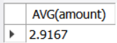

<br>

```
-- 각 사용자 별(GROUP BY)로 한 번 구매 시 구매한 물건 개수(amount) 평균(AVG) 조회
SELECT AVG(amount) AS '평균 구매 개수'
FROM buyTBL
GROUP BY userID
```

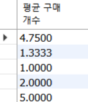

<br>

```
-- 가장 큰 키와 가장 작은 키의 회원 이름과 키 출력 (usertbl)
-- 문제가 어려우면 subQuery로 생각!
SELECT name, height
FROM userTBL
WHERE height = (
	SELECT MAX(height)
    FROM userTBL
) OR height = (
	SELECT MIN(height)
    FROM userTBL
);
```

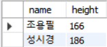

<br>

```
-- 사용자별 총 구매 금액이 1,000 이상인 사용자만 출력
SELECT userID, SUM(price*amount) AS "총 구매금액"
FROM buyTBL
-- WHERE SUM(price * amount) >= 1000 : WHERE 절에는 집계함수를 사용할 수 없음
GROUP BY userID
HAVING SUM(price * amount) >= 1000;	-- HAVING : GROUP으로 묶은 각각의 record 중 조건에 부합하는 record만 SELECT하겠다!
```

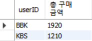

<br><br><br>

# Transaction
: 작업의 최소단위
- 임의로 설정할 수 있는 개념
- 여러 SQL 문장을 하나의 논리적인 단위인 <strong>Transaction</strong>으로 설정

<br>

## Transaction을 설정하는 이유
### DBMS가 SQL 코드에 ACID 특성을 적용해줌
- 필수적으로 설정해야 합니다!

<br><br>

## 🌟ACID🌟
- A (Atomioty) : 원자성 ▶ All or Nothing
    
        이체 작업 (Transaction)
        - A 계좌 SELECT
        - A 계좌 UPDATE
        - B 계좌 SELECT
        - B 계좌 UPDATE
        
    - 전체 작업이 동일한 상태로 종료됨 (원자성)

- C (Consistency) : 일관성 ▶ Transaction 종료 후 제약 조건에 위배되는 데이터가 DB에 저장되는 것을 방지
    - Transaction <strong>종료 후 결과</strong>가 correct state (제약조건을 충족해야 함)
- I (Isolation) : 독립성 ▶ 현재 Transaction이 종료될 때까지 해당 resource에 대한 Thread의 동기화 처리
- D (Durability) : 영속성 ▶ Transaction이 정상적으로 종료되면 해당 결과가 2차 저장소(DB)에 영구적으로 저장됨

<br><br>

## Transaction 설정
### Transaction 종료 후 
- Commit(Transaction 정상 반영)
- Rollback(Transaction 무효화)

```
SELECT distinct userid
FROM buytbl;
```
<br>

- 이후 모든 SQL 문장들은 Transaction에 포함됨
```
START TRANSACTION;
DELETE
FROM buyTbl;
```
- Transaction 작업 무효
```
ROLLBACK;
```
<br><br>


# INSERT

```
CREATE TABLE testtbl1 (
	id		 INT,
    userName CHAR(3),
    age		 INT
);

SELECT * FROM testtbl1;
```
<br>

- 일반적인 INSERT 구문
```
INSERT INTO testtbl1 VALUES(1, '홍길동', 25);
```

<br>

- 필요한 것만 선택해서 데이터 입력
```
INSERT INTO testtbl1(id, userName) VALUES(2, '이순신');
```
<br>

- 순서 상관 없음!
```
INSERT INTO testtbl1(userName, id) VALUES('강감찬', 3);
```

<br><br>

# DELETE
```
CREATE TABLE testtbl3 (
	id INT,
    fname VARCHAR(50),
    lname VARCHAR(50)
);

INSERT INTO testtbl3
	SELECT emp_no, first_name, last_name
    FROM employees.employees;

SELECT * FROM testtbl3;

START TRANSACTION;
-- UPDATE 구문
UPDATE testtbl3
SET lname = '없음'
WHERE fname = 'Kyoichi';

SELECT * FROM testtbl3 where fname = 'kyoichi';

ROLLBACK;


SELECT * FROM testtbl3 where fname = 'kyoichi';

-- DELETE 구문
DELETE
FROM testtbl3
WHERE fname = 'Kyoichi'
LIMIT 100;

SELECT * FROM testtbl3 where fname = 'kyoichi';

```
# UPDATE
<br><br><br>

## auto_increment
- 숫자 형식만 가능 (자동으로 증가)
- PRIMARY KEY or UNIQUE 제약조건 필요
```
CREATE TABLE testtbl2 (
	id		 INT auto_increment PRIMARY KEY,
    userName CHAR(3),
    age		 INT
);
```
```
SELECT * FROM testtbl2;
INSERT INTO testtbl2 VALUES(NULL, '홍길동', 25);
INSERT INTO testtbl2 VALUES(NULL, '김길동', 30);
```
```
ALTER TABLE testtbl2 auto_increment = 100;
INSERT INTO testtbl2 VALUES(NULL, '김길동', 50);
```
```
SET @@auto_increment_increment = 5;
INSERT INTO testtbl2 VALUES(NULL, '박길동', 60);
```

<br><br><br>

# MySQL
## Data type
1) 숫자
    - INT(4byte) : -21억 ~ 21억
    - BIGUNT(8byte) : -900경 ~ + 900경 = LONG
    - FLOAT(4byte) : 소수점 7자리
    - DOUBLE(8byte) : 소수점 14자리
    - 🌟 DECIMAL : 전체 자리수와 소수점 자리수를 지정할 수 있음

    ▶ FLOAT, DOUBLE은 실수를 근사값으로 저장

2) 문자
    - CHAR : 고정 길이 (1 ~ 255)
    - VARCHAR : 가변 길이 (1 ~ 65535)
    - LONGTEXT : 4G
    - LONGBLOB : 4G

3) 날짜
    - DATE

<br><br>

### 일반적인 용어
- CLOB (Character Large Object) : 대용량의 TEXT = LONGTEXT
- BLOB (Binary Large Object) : 동영상, 이미지 등 = LONGBLOB

<br><br><br>

# 예제 : MySQL이 제공하는 내장 함수

## 문자열 함수

- LENGTH : 해당 문자열의 byte 수
- CHAR_LENGTH : 해당 문자열의 글자 수
```
SELECT CHAR_LENGTH('abcde'),
	   CHAR_LENGTH('홍길동'),
       LENGTH('abcde'),
       LENGTH('홍길동')
```

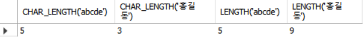

<br>

- CONCAT
- CONCAT_WS

```
SELECT CONCAT('소리없는', '아우성'),
	   CONCAT_WS('-', '2022', '02', '20');
```

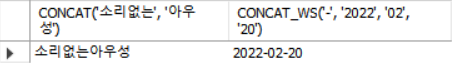

<br>

- FORMAT

```
SELECT FORMAT (123456.1415234, 5);
```

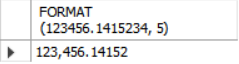

<br>
- TRIM
- REPLACE
- SUBSTRING

```
SELECT TRIM('        소리없는           아우성       '),
	   REPLACE('이것은 소리없는 아우성', '소리', '양심'),
       SUBSTRING('이것은 소리없는 아우성', 3, 5);
```

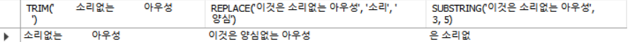

<br><br>

## 날짜 관련 내장함수
- CURDATE
- NOW
- YEAR

```
SELECT CURDATE(),
	   NOW(),
       YEAR(CURDATE());
```

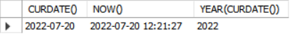

<br><br>

## 데이터 입력
```
INSERT INTO movieTBL VALUES (1, '쉰들러 리스트', 
	LOAD_FILE('C:/sql/Shindler.txt'),
    LOAD_FILE('C:/sql.Shindler.mp4')
);

SELECT * FROM movieTBL;
```
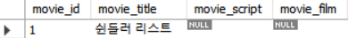


<br><br><br><br>

# Join
- Inner join : 일반적인 join
- Outer join
- Self join
- Cross join (X ▶ 일반적으로 dummy data)

<br>

# 예제

```
SELECT buyTBL.userID, name, addr
FROM buyTBL
	 INNER JOIN userTBL  -- 구매 테이블에서 데이터를 추출할 것이기 때문에 먼저 써줌
     ON buyTBL.userID = userTBL.userID
WHERE buyTBL.userID = 'JYP';
```

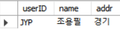

<br>
- alias 이용하여 field명 간단하게

```
SELECT B.userID, name, addr
FROM buyTBL B
	 INNER JOIN userTBL U -- 구매 테이블에서 데이터를 추출할 것이기 때문에 먼저 써줌
     ON B.userID = U.userID
WHERE B.userID = 'JYP';
```

<br><br><br>

### Join과 F.K

```
USE sqldb;

-- 학생 테이블 생성
CREATE TABLE stdTbl (
	std_name VARCHAR(10) NOT NULL PRIMARY KEY,
    std_addr VARCHAR(4) NOT NULL
);

-- 동아리 테이블 생성
CREATE TABLE clubTbl (
	club_name VARCHAR(10) NOT NULL PRIMARY KEY,
    club_room VARCHAR(4) NOT NULL
);

-- 학생_동아리 테이블 생성
CREATE TABLE stdclubtbl (
	num 	  INT AUTO_INCREMENT NOT NULL PRIMARY KEY,
    std_name  VARCHAR(10) NOT NULL,
    club_name VARCHAR(10) NOT NULL,
	FOREIGN KEY (std_name) REFERENCES stdTbl(std_name),
	FOREIGN KEY (club_name) REFERENCES clubTbl(club_name)
);

INSERT INTO stdtbl VALUES ('김범수', '경남');
INSERT INTO stdtbl VALUES ('성시경', '서울');
INSERT INTO stdtbl VALUES ('조용필', '경기');
INSERT INTO stdtbl VALUES ('은지원', '경북');
INSERT INTO stdtbl VALUES ('바비킴', '서울');

INSERT INTO clubtbl VALUES ('수영', '101호');
INSERT INTO clubtbl VALUES ('바둑', '102호');
INSERT INTO clubtbl VALUES ('축구', '103호');
INSERT INTO clubtbl VALUES ('봉사', '104호');

INSERT INTO stdclubtbl VALUES (NULL, '김범수', '바둑');
INSERT INTO stdclubtbl VALUES (NULL, '김범수', '축구');
INSERT INTO stdclubtbl VALUES (NULL, '조용필', '축구');
INSERT INTO stdclubtbl VALUES (NULL, '은지원', '축구');
INSERT INTO stdclubtbl VALUES (NULL, '은지원', '봉사');
INSERT INTO stdclubtbl VALUES (NULL, '바비킴', '봉사');

SELECT * FROM stdclubtbl;
```
<br>

- 학생을 기준으로 학생 이름, 지역, 가입한 동아리, 동아리 방 번호를 출력
```
SELECT S.std_name, S.std_addr, SC.club_name, C.club_room
FROM stdtbl S
	 INNER JOIN stdclubtbl SC
     ON S.std_name = SC.std_name
	 INNER JOIN clubtbl C
     ON SC.club_name = C.club_name
ORDER BY S.std_name;
```

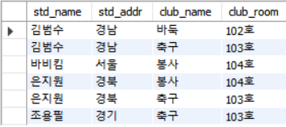

<br><br>

## Outer Join
Join 조건을 만족하지 않는 row(record)도 포함
- LEFT
- RIGHT
- FULL

<br>

- usertbl과 buytbl을 이용해서 다음을 구해보아요!
- 전체 회원의 구매 기록 조회
- 단, 구매 기록이 없는 회원도 출력

```
SELECT U.userId, U.name, B.prodName, U.addr
FROM usertbl U
	INNER JOIN buytbl B
    ON U.userId = B.userId
ORDER BY U.userID;

SELECT U.userId, U.name, B.prodName, U.addr
FROM usertbl U
	LEFT OUTER JOIN buytbl B	-- JOIN 후 버려진 것들이 JOIN 결과에 더해짐
    ON U.userId = B.userId
ORDER BY U.userID
```

- 한번도 구매한 적이 없는 회원의 목록 출력

```
SELECT U.userId, U.name, B.prodName, U.addr
FROM usertbl U
	LEFT OUTER JOIN buytbl B
    ON U.userId = B.userId
WHERE B.prodName IS NULL
ORDER BY U.userId
```

