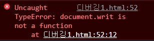
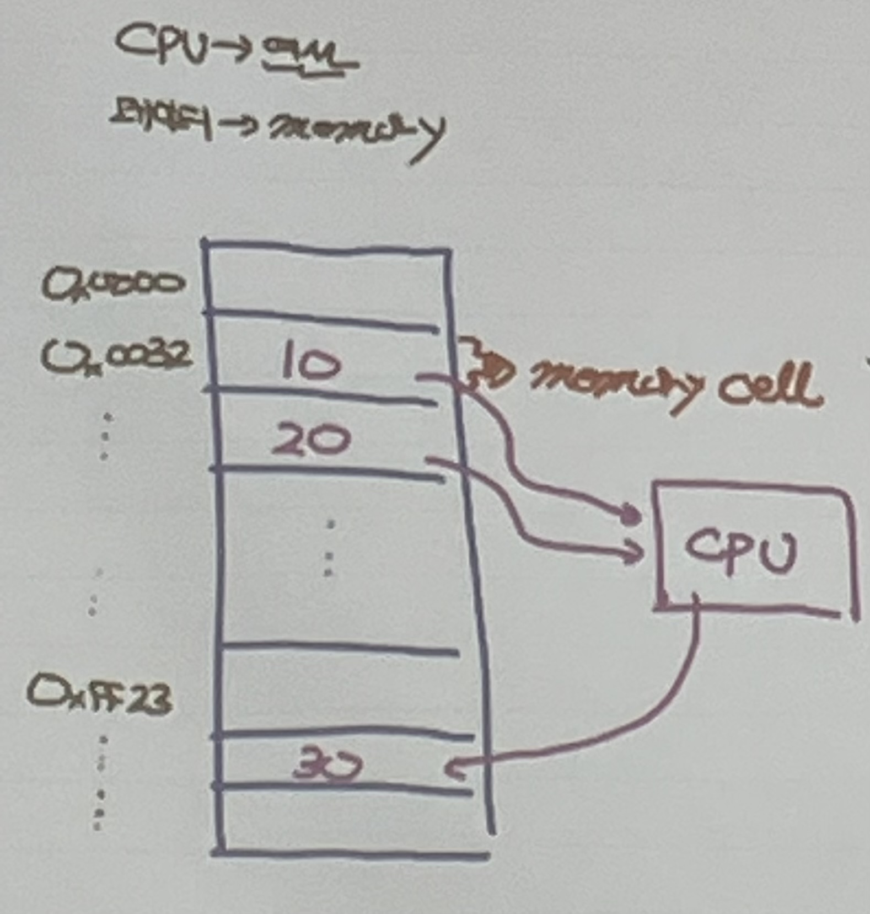
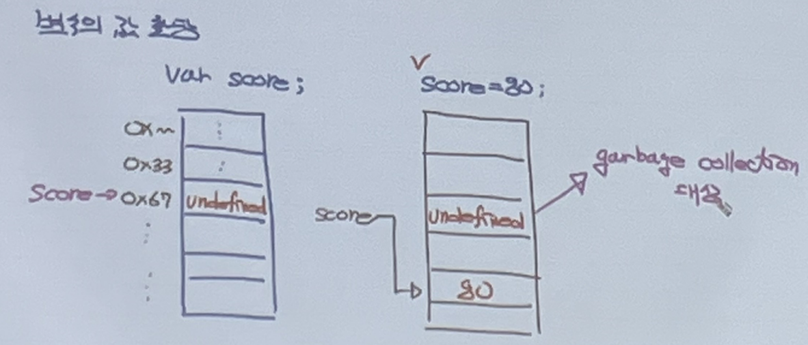

2022. 06. 13
<br /><br />

# 서버-클라이언트 

## 웹 서버 
- 서비스 제공
- 서버에 미리 만들어진 문서를 두고 (html, css, image) 웹 클라이언트가 문서를 요청하면 해당 문서를 찾아서 웹 클라이언트에게 전송하는 일을 한다.
<br /><br />

## WAS(Web Application Server)
- jsp를 해석해서 새로운 문서를 만들어 클라이언트에게 전송한다.
- ex. tomcat, weblogic(대기업), jeus(국가기관, tmax가 제작), resine ......
<br /><br />

## 웹 클라이언트(브라우저)
- 서비스 요청
- 정적 웹 페이지만 서비스를 한다. 
- html, css, js 번역기 역할
- 페이지 요청을 하면 해당 문서를 웹을 통해 서버에서 문서를 다운로드(로컬에 저장) -> 번역해서 화면에 출력
<br /><br />

### 웹 접근성
- 내가 언제 어디서 무슨 상황에 처해있든지 웹을 사용함에 있어 불편함이 없도록 하는 것
<br /><br />

## 서버 - java

      html, css, js, jsp
                                                 Ajax 통신         (데이터를 JSON 형태로)
    클라이언트  <--------->  프론트엔드  <-------------------------> 백엔드
                            ----------                             -------
                            node.js 서버기반 (html, css, js)         자바
                            angular, react, vue, polymer

<br /><br />

## 시멘틱 태그

<ol>
<li>웹 브라우저가 HTML 소스 코드만 보고도 어느 부분이 제목이고 메뉴이고 본문 내용인지 쉽게 알 수 있음</li>
<li>문서 구조가 정확히 나눠지므로 PC나 모바일의 웹 브라우저와 여러 스마트 기기의 다양한 화면에서 웹 문서 표현 쉬움</li>
</ol>

<br /><br /><br />

-----
-----
-----

<br /><br /><br />

2022. 6. 14

# HTML
 
## 이미지
웹에 사용하는 이미지는 파일 크기가 크지 않으면서 화질이 좋아야 함
<ol>
<li>jpeg, jpg : 비트맵 이미지(크기가 큼)를 압축한 것</li>
<li>gif</li>
<li>png : gif 유료화로 인해 개발된 무료 형식</li>
</ol>

<br />

### 이미지 경로
<ol>
<li>상대경로 : 보통 많이 사용하는 지정 방식
<ul>
<li>'.' : 현재 디렉토리 기준</li>
<li>'..' : 상위 디렉토리 기준</li>
</ul>
<li>절대경로 : 서버에는 많은 프로젝트의 이미지가 존재하기 때문에 절대경로 사용 시 수정이 어려움</li>
</ol>
<br />

## 오디오와 비디오
&lt;object&gt;
<br />
속성 : 
controls(컨트롤 바 유무), autoplay(자동재생여부), <br />
loop(반복재생여부), mute(소리 제거),<br />
width, height
<br /><br />

## anchor(닻 = 링크)
속성 : name, target(문서를 띄울 방식)<br />
form 태그 안의 input이어야 서버로 데이터 전송이 가능
<br /><br />

## form 
### method
<ol>
<li>
get(default) : 입력 길이 제한, 데이터 전송 시 사용자가 입력한 내용이 주소표시줄에 나타남, 한글 전송 X(별도의 가공 필요)
</li>
<li>
post(파일 전송 시 post 사용해야 함) : 입력 내용 길이 제한 X, 사용자가 입력한 내용 드러나지 않음
</li>
</ol>

<br /><br />

## id와 name의 차이
id : 모든 태그들이 가질 수 있는 속성, 하나의 HTML 내에 유일한 요소의 이름 => 자바스크립트와 관련

name : 입력 양식 태그(input, textarea, select)만 가질 수 있는 속성, 중복 가능 => 서버와 관련

<br /><br />

## form 요소


fieldset : 폼 요소 그룹

label : 폼 요소에 이름(라벨)을 붙임
<br /><br />

## input

html 파일 간의 정보를 공유하기 위해서는 요소에 담아 전송해야 함
(html 문서 상에서 벌어진 이벤트를 다른 html 문서에서는 알 수 없음)

### input 속성
- autocomplete : 자동완성
- autofocus : 자동으로 입력 커서를 갖다 놓음
- required : 필수 작성 input
- placeholder : 텍스트 입력란에 적당한 힌트 내용 표시

<br /><br /><br />

# CSS 

## 기본 선택자
<ul>
<li>
  전체 선택자 : *
</li>
<li>
클래스 선택자 : .
  
모든 요소에 적용 가능하다.
</li>
<li>
아이디 선택자 : #
  
화면에 출력되는 데에는 중복 id 문제 없음
js로 요소를 선택할 때 문제가 생김
</li>    
</ul>

## div와 span의 차이점
<ul>
<li>div : block 요소</li>
<li>span : inline 요소</li>
</ul>

## 스타일 우선순위
<ol>
<li>!important</li>

- 어떤 스타일보다 우선 적용하는 스타일
- 특별한 경우를 제외하고는 잘 안씀..

<li>인라인 스타일</li>

- 태그 안에 style 속성을 사용해 해당 태그만 스타일 적용

<li>id 스타일</li>

- 지정한 부분에만 적용되는 스타일이지만 한 문서에 한 번만 적용할 수 있음

<li>클래스 스타일</li>

- 웹 문서에서 지정한 부분에만 적용되는 스타일로 한 문서에 여러 번 적용할 수 있음

<li>타입 스타일</li>

- 웹 문서에 사용한 특정 태그에 스타일을 똑같이 적용
</li>
</ol>

<br /><br /><br />

# 자바스크립트 

- 자바스크립트는 인터프리터 언어로, 브라우저에서 해석한다.
- console은 주로 디버깅용으로 사용한다.
  - console.log("Hello javascript!");
- 자바스크립트는 원래 문장 끝에 ;을 붙여야 한다.
- 자동으로 ;이 있는 것으로 인식한다.
- 인터프리터 언어들은 대부분 변수 선언이 필요 없다.
- 인터프리터 언어는 에러가 다양하지 않아서 에러 원인을 파악하기 어렵다.
  
  
## 람다 표현식
[1, 2, 3].forEach(element => console.log(element));

<br /><br /><br />

-----
-----
-----

<br /><br /><br />

2022. 6. 15

# CSS
## Font

### font-size
- em : 부모 요소 폰트의 대문자 M 너비 기준
- rem : root 폰트 기준
- px : 모니터 1픽셀 기준
- pt : 포인트

### font-style
- normal : 기본
- italic : 기울임체

### font-weight
- normal(400)
- bold(700)

### line-height
- 한 문단이 두 줄 이상이면 줄 간격이 생김
- 줄 간격이 너무 좁거나 넓으면 가독성이 떨어짐
- line-height 속성을 이용하여 줄 간격을 원하는 만큼 조절 가능

### text-decoration
- none : 기본
- underline : 밑줄
- overline : 윗줄
- line-through : 취소선


## Layout

### display
- block : 인라인 레벨 요소를 블록 요소 레벨로 만듦
- inline : 블록 레벨 요소를 인라인 레벨 요소로 만듦
- inline-block : 인라인 레벨 요소와 블록 레벨 요소의 속성을 모두 가지고 있으며 마진과 패딩 지정 가능
- none : 해당 요소를 화면에 출력하지 않음

### float
- 웹 요소를 문서 위에 떠 있게 만듦


## 웹 요소 위치 지정

### 위치 속성
- left : 기준 위치와 요소 사이의 왼쪽 거리 설정
- right : 기준 위치와 요소 사이의 오른쪽 거리 설정
- top : 기준 위치와 요소 사이의 위쪽 거리 설정
- bottom : 기준 위치와 요소 사이의 아래쪽 거리 설정

### position
- static : 문서의 흐름에 맞춰 배치 (기본값)
- relative : 현재 요소의 위치 기준 (static과 유사)
- absolute : static이 아닌 상위 요소 기준
- fixed : 브라우저 창 기준


## Box Model
- content
- padding
- border
- margin

<br /><br /><br />

# 자바스크립트

## console 창으로 debug
```
document.writ();
```
 <br>
자바스크립트 에러가 콘솔 창에 출력됨
  

## "use strict";
자바스크립트의 원래 문법보다 더 엄격하게 만들어 줌

## 호이스팅
함수 안에 있는 선언들을 모두 끌어올려서 해당 함수 유효 범위의 최상단에 선언하는 것을 말한다.

## Array

### 배열 생성 방법
<ol>
<li>
선언, 대괄호([])를 사용하여 생성

```
let arr = [];
```

</li>
<li>
Array 객체와 new 키워드로 생성

```
let arr = new Array();
```
</li>
</ol>

### 배열 관련 메서드
- arr.push(a) : a를 배열 arr의 가장 뒤에 삽입
- arr.concat(a, b, c) : 배열 arr에 a, b, c를 붙임(삽입) -> 배열 원본 변경 X
- arr.join("(구분자)") : 배열 요소를 문자열로 묶어줌 -> 배열 원본 변경 X

## 등호 연산자
- '==' : 자바스크립트의 자동 형변환으로 인해 자료형에 관계없이 값이 같으면 같다는 결과를 출력
- '===' : 자료형과 값을 함께 비교

<br /><br /><br />

-----
-----
-----

<br /><br /><br />

2022. 6. 16

# CSS

## background
### background-image
```
background-image: url('이미지 경로');
```

### background-repeat
: 배경 이미지를 가로와 세로 중에서 어떤 방향으로 반복할지 지정하거나, 반복하지 않고 한 번만 나타나게 할 수 있음
- repeat : 브라우저 화면을 가득 차게 가로, 세로 모두 반복
- repeat-x : 가로 반복
- repeat-y : 세로 반복
- no-repeat : 반복  X

### background-position
: 배경 이미지의 수평 위치 또는 수직 위치 값 지정
```
background-position: <수평 위치> <수직 위치>
```

### background-origin
: 배경 이미지를 적용할 범위 지정
- content-box
- padding-box
- border-box

### background-attachment
: 배경 이미지를 원하는 위치에 고정
- scroll : 화면을 스크롤 하면 배경 이미지도 스크롤 된다. (기본값)
- fixed : 화면을 스크롤 해도 이미지는 고정되어 있다.

<br>
<br>

## Selector
### 하위 선택자 (자손 선택자)
: 부모 요소에 포함된 하위 요소를 모두 선택, 공백
```
부모요소 자식요소
```

### 자식 선택자
: 자식 요소에만 스타일을 적용하는 선택자, 
```
부모요소 > 자식요소
```

### 형제 선택자
#### 인접 형제 선택자
: 형제 요소 중 첫 번째 동생 요소만 선택, +
```
요소1 + 요소2
```

#### 형제 선택자
: 모든 형제 요소 선택
```
요소1 ~ 요소2
```

### 속성 선택자
#### [속성] 선택자
:속성값에 따라 원하는 요소 선택
  
특정 속성이 있는 요소 선택

```
a[href] { 
  ...
}
```
: href 속성을 가지고 있는 a 요소 선택

#### [속성=속성값] 선택자
: 특정 속성값이 있는 요소 선택
 
주어진 속성과 속성값이 일치하는 요소를 찾아 스타일 지정할 때 사용

```
a[target = _blank] { 
  ... 
}
```

<br>
<br>

## 가상 클래스와 가상 요소
### 사용자 동작에 반응하는 가상 클래스
- :link 가상 클래스 선택자 : 방문하지 않은 링크에 스타일 적용
- :visited 가상 클래스 선택자 : 방문한 링크에 스타일 적용
- :hover 가상 클래스 선택자 : 특정 요소에 마우스 포인터를 올려놓으면 스타일 적용
- :active 가상 클래스 선택자 : 웹 요소를 활성화했을 때 스타일 적용
- :focus 가상 클래스 선택자 : 웹 요소에 초점이 맞추어졌을 때 스타일 적용
  
### 요소 상태에 따른 가상 클래스
- .target 가상 클래스 선택자 : 앵커 대상에 스타일 적용
- .enabled와 .disabled 가상 클래스 선택자 : 요소의 사용 여부에 따라 스타일 적용
- .checked 가상 클래스 선택자 : 선택한 항목의 스타일 적용
- .not 가상 클래스 선택자 : 특정 요소를 제외하고 스타일 적용

### 구조 가상 클래스

### 가상 요소
- ::first-line : 첫 번째 줄 선택
- ::first-letter : 줄에서 첫 번째 글자 선택
- ::before : 특정 요소의 앞에 내용이나 스타일 추가
- ::after : 특정 요소의 뒤에 내용이나 스타일 추가

<br><br><br>  

# 반응형 웹
: 웹 요소를 화면 크기에 맞게 재배치하고 각 요소의 표시 방법만 바꾸어 사이트 구현

## viewport
: 스마트폰 화면에서 실제 내용이 표시되는 영역
- ```<meta http-equiv="X-UA-Compatible" content="IE=edge">```  
 : edge 브라우저 호환성을 위한 태그
- ```<meta name="viewport" content="width=device-width, initial-scale=1.0">```  
 : 모바일 가로, 세로 방향 화면 출력을 위한 태그

<br />
<br />
<br />
<br />

# JS

## 조건문
### if 문
```
let year = prompt("연도를 입력하세요.");

if (year%4===0 && year%100!==0 || year%400===0 )
 console.log(`${year}년은 윤년입니다.`);
else
 console.log(`${year}년은 윤년이 아닙니다.`);
```

<br />

## 반복문

### while 문
```  
let i = 1;
while (i <= 10) {
  console.log(i);
  i++;
}
```

### for 문
```
let flowers = ["작약", "백일홍", "접시꽃", "천일홍", "목단", "진달래", "장미"];
```
```
for (i=0; i < flowers.length; i++) 
 console.log(flowers[i]);
```
```
for (i in flowers)
 console.log(flowers[i]);
```
```
for (item of flowers)
 console.log(item);
```
```
flowers.forEach(item => console.log(item));
```

<br />

## JSON
```
let person = {"name": "홍길동", "age": 18,};
console.log(person["name"]); // '홍길동'
console.log(person["age"]); // 18
console.log(person.name); // '홍길동'
console.log(person.age); // 18
```

### JSON 배열
```
let personList = [
  { "name": "홍길동", "age": 23, "phone": "010-0000-0000", "address": "신림동" },
  { "name": "임꺽정", "age": 27, "phone": "010-0000-0001", "address": "봉천동" },
  { "name": "장길산", "age": 26, "phone": "010-0000-0002", "address": "서초동" },
  { "name": "홍경래", "age": 28, "phone": "010-0000-0003", "address": "양재동" },
  { "name": "강감찬", "age": 33, "phone": "010-0000-0004", "address": "낙성대" }
];
  
  
// for 문
for (i = 0; i < personList.length; i++) 
 console.log(`${personList[i].name} ${personList[i].age} 
  ${personList[i].address} ${personList[i].phone}`);

// for in 문
for (i in personList)
 console.log(`${personList[i].name} ${personList[i].age}
   ${personList[i].address} ${personList[i].phone}`);

// for of 문
for (person of personList)
 console.log(`${person.name} ${person.age}
  ${person.address} ${person.phone}`);

// forEach 문
personList.forEach(person => 
 console.log(`${person.name} ${person.age}
  ${person.address} ${person.phone}`));
```

<br /><br /><br />

-----
-----
-----

<br /><br /><br />

2022. 6. 17

# JS

## 함수 표현식
- 함수 선언(문) 방식으로 함수를 생성하면, 함수가 독립된 구문 형태로 존재
- 함수 표현식 방식으로 함수를 생성하면, 함수가 표현식의 일부로 존재 (쓰고 버리는 일회용 함수) -> 함수가 선언된 라인에서 메모리가 할당되고 함수가 끝나면 메모리에서 사라짐

<br><br>

## 콜백 함수 : 함수에 인자로 전달하기 위한 함수
자바스크립트는 비동기 모드를 지원함
- 함수 작성자와 호출자가 다르다. 함수의 주소를 매개변수로 전달할 수 있고 콜백함수는 전달받은 함수에 의해 호출된다.
- 보통 이벤트 핸들러나 Ajax, 네트워크 처리 등 시스템에 의해 부분적인 일처리가 필요할 때 많이 사용된다.
- 특히 자바스크립트의 경우 비동기 I/O 방식을 기본으로 사용하기 때문에 시스템에 의해서 호출될 콜백함수를 많이 만든다.

### 비동기 처리
- 보통의 함수처럼 하나의 task를 처리한 후 다음 task를 처리하는 것이 아닌 함수값을 리턴한 후 백그라운드에서 시스템이 task 처리를 수행함
- 백그라운드에서 task를 처리하다가 완료된 시점에 콜백 함수로 완료되었음을 알림
- 콜백 함수를 만들어 콜백 함수의 주소를 전달하면 시스템이 호출
- 콜백 함수가 굳이 함수의 선언문 형태로 있을 필요는 없음
- 함수의 표현식 또는 화살표 함수로 전달된다.

<br><br>

## window.onload
 : html 문서가 모두 메모리에 로딩된 후에 발생하는 이벤트이다.
### 이벤트가 발생했을 때 함수를 호출하는 방법
<ol>    
<li>
함수 표현식을 사용

```
window.onload = function () {
  document.getElementById("xvalue").value = 100;
}
```
</li>
<li>
함수 선언문을 사용

```
function onLoad() { document.getElementById("xvalue").value = 1000; }
window.onload = onLoad;
```
</li>
<li>
화살표 함수 : 함수 내부에서 this 사용 불가

```
window.onload = () => document.getElementById("xvalue").value = 10000;
```
</li>
</ol>

<br><br>

## filter + 콜백 함수
  ```
  let arr = [3, 2, 1, 4, 7, 8, 9, 11, 12, 19, 16];

  function odd(x) { return x % 2 === 1; }
  let result = arr.filter(odd);
  console.log(result);

  console.log(arr.filter( function (x) { return x % 2 === 1}));
  console.log(arr.filter( x => { return x % 2 === 1} ));
  console.log(arr.filter( x => x % 2 === 1 ));
  ```

<br><br>

## 화살표 함수
- 람다함수, 함수 선언식보다 간결하게 함수를 만들 수 있는데 이걸 화살표 함수라고 한다.
- 함수 표현식에서 function 키워드를 생략하고 () => {} 형태의 함수를 만들 수 있다.
- 표현이 간결하고 사용이 편해서 많은 라이브러리들이 사용하고 있다.

<br><br>

## Array 메서드
### .map()
: 리스트 내 모든 원소의 특정 연산 수행 

### .find()
: 특정 원소 1개를 찾아냄 (filter는 특정 조건을 성립하는 원소 모두 추출)

### .reduce()
: 누적 연산

<br><br>

## Array 예제

```
let numArray = [10, 20, 3, -5, 7, -1, 9, 12, 13, -4, 6];
  
let wordArray = [
  "school", "hospital", "assembly", "compile", "default",
  "constructor", "desk", "object", "class", "function",
  "procedure", "alt", "bread", "milk"
];

let stuArray = [
{"class": "1", "name": "A", "kor": 90, "eng": 90, "mat": 90},
{"class": "2", "name": "A", "kor": 80, "eng": 60, "mat": 80},
{"class": "2", "name": "A", "kor": 70, "eng": 70, "mat": 90},
{"class": "1", "name": "A", "kor": 100, "eng": 90, "mat": 90},
{"class": "2", "name": "A", "kor": 95, "eng": 80, "mat": 100},
{"class": "1", "name": "A", "kor": 75, "eng": 60, "mat": 60}
];
```

문 1. numArray에서 음수만 찾아내기
```
let numResult = numArray.filter(num => num < 0);
console.log(numResult);
```

문 2. wordArray에서 단어 길이가 6글자 이상인 것만 추출하기
```
let wordResult = wordArray.filter(word => word.length >= 6);
console.log(wordResult);
```

문 3. class가 1인 학생들과 2인 학생들 분리하기
```
let stuResult1 = stuArray.filter(stu => stu["class"] === "1")
console.log("Class 1 : ", stuResult1);
let stuResult2 = stuArray.filter(stu => stu["class"] === "2")
console.log("Class 2 : ", stuResult2);
```

문 4. stuArray에 총점과 평균 계산하여 넣기
```
let stuResult3 = stuArray.map(stu => {
  stu["sum"] = stu["kor"] + stu["eng"] + stu["mat"];
  stu["avg"] = stu["sum"] / 3;
  return stu;
})
console.log(stuResult3);
```

## Promise

###
- resolve - then
- reject - catch

### async와 await
- function 앞에  async를 붙이면 해당 함수는 항상 프라미스를 반환한다.
- 프라미스가 아닌 값을 반환하더라도 이행 상태의 프라미스로 감싸 이행된 프라미스가 반환되도록 한다.
- 자바스크립트는 await 키워드를 만나면 프라미스가 처리(settled)될 때까지 기다린다.

<br /><br /><br />

-----
-----
-----

<br /><br /><br />

2022. 6. 20

# Event
- 이벤트란 브라우저에서 일어나는 모든 동작들을 말한다.
- 버튼 클릭, 키보드 입력, 마우스 클릭, 화면 드래그 동작 등이 이벤트이다. 

## Event handler
- 각 이벤트마다 기본 처리 동작이 이미 정의되어 있는데 이를 가로채 다른 동작을 부여할 수 있다.
- 사용자는 함수를 만들어서 각 이벤트를 별도로 처리할 수 있다.

<br /><br /><br />

-----
-----
-----

<br /><br /><br />

2022. 6. 20

# 크로스 브라우징
- 최대한 많은 종류의 웹 브라우저에서 정상적으로 작동하는 웹페이지를 만드는 방법론 중 하나
- 웹 페이지 제작 시에 모든 브라우저에서 깨지지 않고 의도한 대로 올바르게(호환성) 나오게 하는 작업

# JQuery
- 모든 브라우저에서 동작하는 클라이언트 자바스크립트 라이브러리

## JQuery 배경
- 고객이 사용하는 브라우저마다 다른 코드를 작성해야 했는데 JQuery는 표준화되어 사용자가 대거 유입되었음

## 제작 목표
- DOM과 관련된 처리 쉽게 구현
- 일관된 이벤트 연결 쉽게 구현
- 시각적 효과 쉽게 구현
- Ajax 애플리케이션 쉽게 개발

## 장점
- 복잡한 자바스크립트 문법을 간소화
- 크로스 브라우징
- 다양한 오픈소스 라이브러리

## $()
- 선택자
```
$("p").click(function() {
  ...
})
```
- 메소드 정의 : html 로드가 완료되면 실행되는 메소드 정의
```
$(function() {
  ...
})
```

## button과 input:button
- button : 텍스트 뿐만 아니라 이미지 등을 자식 요소로 포함할 수 있고, submit 기능이 있기 때문에 submit을 원하지 않으면 type="button"으로 지정해주면 된다.
- input type="button" : <button>에 비해서 디자인에 제약이 있다.

<br /><br /><br />

# Spring

## 루프백 주소 : 자신의 컴퓨터 아이피(localhost, 127.0.0.1)
- cmd : ipconfig - ifconfig
- http://127.0.0.1:8080/myhome1/
- http://localhost:8080/myhome1/

## 아이피 : 컴퓨터를 찾아가기 위한 값
    1byte.1byte.1byte.1byte - 총 4byte => 표준 8byte
    0~255,0~255,0~255,0~255

## 포트 : 프로세스 식별값이라고 부르기도 한다.
## 소켓 : 소켓의 식별값 (OSI 7계층의 Transport 계층)

- 1 ~ 65535 : 2byte 정수 범위 1000 이하의 값은 알려진 포트번호이기 때문에 사용 불가
- http : 80, ftp : 21, telnet : 23
- oracle : 1521, mssql : 1433, mysql : 3306

<br /><br /><br />

-----
-----
-----

<br /><br /><br />

2022. 6. 22

# Spring

## WEB-INF
- WEB-INF의 보안으로 인해 이 폴더 내부의 문서에는 접근 불가능하다.

## 에러
- 폴더나 파일명(대소문자) 때문에 발생하는 에러는 이름을 아예 바꿨다가 원하는 이름으로 바꾸면 에러가 해결됨

## Context
```
<script src="<%=request.getContextPath()%>/jquery/jquery-3.6.0.min.js"></script>
```
- <%=request.getContextPath()%> : 상대주소, 절대주소 없이 파일이 어디있든 Context(경로)를 자동으로 인식해 찾아줌


# AJAX
## XMLHTTPRequest 객체 메서드
### onreadystatdchange
서버가 전송해준 데이터는 response 객체로 만들어져서 브라우저에 도착하고, 브라우저가 이것을 사용자에게 보여줌
- readyState
- responseText, responseXML
- status : 200(OK)이 들어오면 브라우저가 정상적으로 문서(html)를 화면에 출력해줌
<br />
- Ajax의 경우에는 웹서버로부터 요청을 받아야 하므로 php나 asp, tomcat 등의 웹서버가 있어야 테스트가 가능

<br /><br /><br />

-----
-----
-----

<br /><br /><br />

2022. 6. 24

# Servlet
## Package
- 패키지 명 : 도메인 거꾸로
ex. com.rapa.control > com\rapa\control directory가 생성됨

- servlet을 생성하면 javax.servlet.http.HttpServlet 클래스를 상속받게 되어있음 > servlet은 inf 폴더 내에 위치해있어 접근이 불가능하기 때문에 상속받은 클래스를 통해 접근해야 함

## 모델
 ### 모델 1 : html, css, javascript, java가 같은 파일에 있다.
  문제점
  <ol>
  <li>디자인 변경 시 디자이너가 못 건들임, 프로그래머가 수정을 도와주어야 함</li>
  <li>디자인이나 프로그램을 개편할 경우 모두 다시 만들어야 함</li>
  </ol>

### 모델 2
  화면단(presentation)과 비즈니스 로직(데이터베이스에 데이터 입출력)을 분리
  
  #### MVC
    M : model, 비즈니스 로직(데이터베이스 입출력)
    V : view, presentation(html, css, javascript, 최소한의 java)
    C : controller, view와 model을 연결해주는 역할(servlet의 역할이 중요)

  #### 프레임워크화 - Spring framework

  - 디자인 파트에 자바 소스가 많지 않기 때문에 디자이너가 수정 가능
  - 프레젠테이션 개별 수정이 가능 (사이트 개편 시 개편할 부분만 수정하면 됨)

## 모델 2 방식의 게시판 제작
- DB가 없으므로 Model 단에서 데이터를 만들고 컨트롤러를 통해 이 데이터를 view 파트로 보냄
- request 객체에 저장해 jsp로 전달
- jsp는 request 객체로부터 값을 읽어 출력

- 서블릿을 컨트롤러로 사용
- 요청이 list.jsp, write.jsp, view.jsp
- 요청 시 기본 파라미터로 cmd를 넘겨줌 : cmd(list, write, view, save)
- 모델
DTO(Data Transfer Object) - DB의 테이블과 1:1 맵핑인 경우가 많음
                          - 디비의 필드명들이 클래스의 멤버변수가 됨
                          - 여러 개의 테이블이 합쳐져서 전달되는 경우 테이블과 1:1 맵핑 불가능
DAO(Data Access Object) - DB 데이터 read/write 클래스

<br /><br /><br />

-----
-----
-----

<br /><br /><br />

2022. 6. 27

# Node.js

<ol>
<li>
  http 객체 로드 (필요한 라이브러리 load)
  ```
  let http = require('http');
  ```
</li>
<li>
  http.Server 객체 생성 (서버 생성)

  ```
  let server = http.createServer();
  ```
  createServer 메서드에 클라이언트의 요청이 오면 실행할 함수를 인수로 전달
  ```
  http.createServer(function() {
    ...
  }).listen();
  ```
</li>
<li>
  "request" 이벤트가 발생하면 doRequest 함수를 실행

  ```
  server.on('request', doRequest);
  ```
</li>
<li>
  http.Server 객체가 준비되면 "listen" 메소드 실행
  ```
  server.listen(1234);
  ```
</li>

## export
- 사용자가 만든 모듈을 export 할 때 사용
- 모듈 내보내기 (화살표 함수의 경우만 가능)
```
  let app = expess();
  module.exports = app; 
```
- 일반 함수의 경우 ([JSON])이다.

## 서버 자동 재시작
- npm i supervisor -g
- npm i nodemon

<br /><br /><br />

-----
-----
-----

<br /><br /><br />

2022. 7. 4
<br>
<br>
##### ECMAScript -> React
##### Java -> Database -> Servlet -> Spring
<br>

# Javascript
## ECMAScript

- Netscape사의 "브랜든 아이크" (1995)
- 프로토 타입 기반의 함수형 언어(not object) -> Mocha -> LiveScript -> JavaScript
- 표준화 : ECMA(비영리 표준기구)에서 진행 -> ECMAScript라는 이름으로 표준화가 진행됨
  - JavaScript와 ECMAScript는 다른 것이다.
  - JavaScript = ECMAScript + Client Side Web API(BOM, DOM, Web Storage, IndexedDB, Canvas)
              = ECMAScript + Host API (Node)
  - ECMAScript 2015 = ES6

- MS사에서는 독자적인 스크립트 언어인 JScript를 만들었음
  - Fragmentation(파편화) : 브라우저마다 다른 방식으로 문서를 출력하기 때문에 파편화 현상 발생

- 언어의 모호성
- 구현의 어려움
- JQuery의 등장으로 JS의 인식이 좋아짐
<br />
<br />

## JQuery
### JQuery 장점
- DOM 요소를 쉽게 다룰 수 있음
<br />
<br />

### JQuery 단점
- 기술의 종속성
- 비표준 라이브러리 => 유지보수가 어려움(로직을 사용자가 직접 설계해야 함)

<br />
<br />

# HTML5와 JavaScript
- HTML, CSS 표준 : W3C가 관장
  - HTML : 정형성이 없음 (문법의 오류를 잡아내지 못함), 확장성이 없음 (기존의 HTML 요소로만 웹을 구성)
  - XML : 정형성 O, 확장성 O (HTML을 보완할 수 있는 마크업 언어)
- HTML + XML => XHTML 1.0 (2000년 1월)
<br />
<br />

## WHATW
HTML만을 발전시킴 -> HTML5 (Google, Apple이 사용) => 표준화

## HTML5
- 브라우저만 있으면 모든 프로그램을 실행할 수 있게 하기 위한 목적
- Web Application
- HTML5 = HTML(25%) + CSS3(5%) + JavaScript Web API(70%) (웹 어플리케이션을 만들기 위해)
- HTML5의 등장으로 JavaScript의 위상이 올라감
- 더불어 Node.js도 JS의 위상을 높여줌

## TypeScript
- MS(MicroSoft)의 메타 언어(2012)
- TypeScript 코드를 Transpile하면 JavaScript로 변환됨 (meta programming)
- 컴파일 : 코드를 기계어로 변환
- Meta Programming : JavaScript에는 없는 기능을 TypeScript를 사용하여 추가할 수 있음

<br />
<br />

# Web (Frontend 단)
## Package Manager
- npm(Node Package Manager) : module 간의 버전을 맞춰줌
## Transpiler
- TypeScript
## 자동화 도구
- build, test, deploy를 자동화 -> gulp
## module화 (컴포넌트화)
- webpack
## framework
- Angular(google), React(meta), Vue.js

<br />
<br />

# JavaScript Engine 
- 브라우저를 제작할 때, 브라우저 엔진도 함께 제작 (브라우저 내에 엔진 내장)
- Chrome -> V8 Engine
- Edge -> Chakra Engine
- Safari -> Webkit Engine
- Firefox -> SpiderMonkey Engine
- Node.js Engine -> V8 Engine


<br />
<br />
<br />
<br />

# 변수


- Memory Address : Variable을 이용해 메모리에 접근
  - Memory Address에 대한 직접적인 접근 불가
  - 변수 = 식별자(Identifier)

## Naming Rule
- ($, _) 제외한 특수문자 불가능
- 숫자 시작 불가능

## Variable Declaration (변수 선언)
- 변수 생성

  ### 변수 생성 방법
  - var : function level scope
  - ES6 이후 신규 : block level scope
    - let
    - const

  ```
  var scope;
  ```
  - 결과 : 
  <ol>
    <li>
    JS 엔진에 의해 undefined로 초기화 됨
    </li>
    <li>
    식별자 scope가 execution context(실행 컨텍스트)에 key/value 형태로 저장됨
    </li>
  </ol>
    
    - undefined : primitive value, JS Engine에 의해 사용되므로 개발자의 직접 사용이 지양됨, 변수를 초기화할 때 사용

<br />
<br />

## Variable Hoisting (호이스팅)
  ```
  console.log(score); // undefined

  var score;
  ```
  - 자바스크립트는 런타임 이전에 해당 스코프 내의 변수의 선언을 확인하고 스코프 최상단을로 변수의 선언을 끌어올리는 것처럼 동작

<br />

### keyword : var 
- var keyword로 변수의 중복선언이 가능
  - 실제로는 식별자가 이미 존재하면 var keyword가 없는 것처럼 동작

<br/>

```
var x = 1;
var x = 100;
```
- 초기화 구문이 없으면 무시

<br />

```
var y = 2;
var y;
```
- function level scope 생성
  - 함수 내에서도 호이스팅이 발생

<br />

```
var x = 1;  // 전역변수
if(true) {
  var x = 100;
}

console.log(x); // 100
```
```
var i = 100;
for (var i = 0; i < 5; i++) {
  console.log(i);
}

console.log(i); // 5
```
```
var x = 1;
function myFunc() {
  var x = 100;  // function level scope
  console.log(x); // 100
}
console.log(x); // 1
```

<br />

### ES6에서 추가된 keyword : let, const
  - 중복 선언 금지
  - block level scope
  - let 사용 시 호이스팅이 안되는 것처럼 보임

<br />

#### keyword : let
  - 변수를 일시적으로 사용할 수 없는 구간이 생김 => Temporal DeadZone
```
  let i = 100;
  let i = 10; // SyntaxError : 이미 선언되어 있음
```
```
let score = 100;
{
  let score = 10;
}
```
```
console.log(myVar);
let myVar = 100;  // Error
```

```
let myVar = 1;
{
  console.log(myVar); // ReferenceError: myVar is not defined
  let myVar = 100;
}
```

## 변수의 값 할당


<br />
<br />

## Naming Rule
- ($, _) 제외한 특수문자 불가능
- 숫자 시작 불가능

## Naming convention
<ol>
  <li>
  camelCase
  </li>
  <li>
  snake_case
  </li>
  <li>
  PascalCase
  </li>
  <li>
  typeHungationCase
  </li>
</ol>

<br />
<br />
<br />
<br />


< 기본 용어 >
<ol>
<li>
  Literal(리터럴) : 특정값을 표현하기 위해 사람이 이해할 수 있는 문자, 약속된 기호를 이용하는 표기법(notation)
  <br />
  ex. 3 : 정수 literal
  <br />
  ex. 'Hello', "Hello", `Hello` : 문자 literal
  <br />
  ex. null : null literal (변수가 가리키는 값이 없음)
  <br />
  ex. undefined : undefined literal (변수가 선언되었지만 초기화되지 않음)
  <br />
  ex. {'name': 'kim'} : 객체 literal
  <br />
  ex. [1, 2, 3] : 배열 literal
  <br />
  ex. function() {} : 함수 literal
</li>
<br />
<li>
  Statement(문) : 프로그램의 최소 실행 단위
  <br />
  - program은 statement의 집합
  <br />
  - 'var' 'sum' '=' '1' '+' '2' 각각은 token -> statement를 구성하는 최소 단위
  <br />
  - ';' : statement의 종결을 나타냄 (블록 단위의 중괄호는 self closing이 가능해 세미콜론을 찍지 않아도 됨)
  <br />
  - 세미콜론은 생략해도 ASI(Automatic Semicolon Insertion)가 동작하지만 명확한 code를 위해 생략 X
  <br />
</li>
<li>
  Expression(식) : 평가과정을 통해 값으로 인식되는 구문
</li>
</ol>


<br />
<br />
<br />
<br />

# Data Type
- primitive type(원시타입)
  - number : 정수, 실수를 구분하지 않음, 내부적으로 모든 숫자는 64bit 실수로 처리

    ```
    let myVar = 1.0;
    console.log(myVar === 1); // true
    console.log(3/2); // 1.5
    ```
  
    - infinity : 양의 무한대
    - -infinity : 음의 무한대
    - NaN : Not a number (산술 연산 불가)

  - string
    - 멀티라인 문자열 표현 가능
    - Expression Interpolation(표현식 삽입)
    ```
    let str = '이것은\n소리없는\n아우성';
    let str1 = `이것은
    소리없는
    아우성`;
    ```

    ```
    let name = '홍길동';
    console.log('내 이름은 ' + name + '입니다.);
    console.log(`내 이름은 ${name} 입니다.`);
    ```
  - boolean
  - undefined
  - null
  - symbol (ES6)
    - 겹치지 않는 고유한 값을 부여하기 위해 사용 (Unique)
    - 값이 얼마인지 확인할 수 없음 (출력 불가)
    - Symbol()을 이용해 만듦 : 인자를 사용할 수 있지만..
    
    <br />

    #### Global Symbol Registry 사용
      - Symbol.for() : key 값을 이용해서 Symbol을 찾거나 못찾으면 Symbol을 생성, 등록, 반환
      - Symbol.keyFor() : Symbol 값으로 key를 찾음

    <br />
    
    ```
    const mySymbol = Symbol();
    console.log(typeof mySymbol); // symbol
    console.log(mySymbol);  // Symbol() 값이 노출되지 않음
    ```
    ```
    const mySymbol1 = Symbol('소리없는 아우성');
    const mySymbol2 = Symbol('소리없는 아우성');

    console.log(mySymbol1 === mySymbol2)  // false
    console.log(mySymbol1.description); // 소리없는 아우성

    if(mySymbol1) {
      console.log('Symbol 값이 있음');
    }
    ```
    ```
    const s1 = Symbol.for('mySymbol');
    // global symbol resistry라는 곳이 있음
    // 일단 거기에서 해당 인자를 키로 가지고 있는 symbol을 찾음
    // 만약 존재하지 않으면 symbol을 만들고
    // global symbol registry에 등록하고 symbol을 리턴
    const s2 = Symbol.for('mySymbol');
    console.log(s1 === s2); // true

    console.log(Symbol.keyFor(s2));  // mySymbol
    ```
    ```
    const Direction = {
      'UP': 1,
      'DOWN': 2,
      'LEFT': 3,
      'RIGHT': 4
    }
    let myDirection = Direction.UP; // key 값이 중요

    if(myDirection == Direction.UP) {
      ...
    }
    ```
- Reference type
  - Object

<br />
<br />
<br />
<br />

# 변수의 Data Type
## JavaScript
- JavaScript 변수에 값이 할당되는 시점에 Type이 결정됨 => Type inference (타입 추출) = Dynamic typing(동적 타이핑)
- 이러한 언어를 Dynamic - Weak Type Language
## Java
- 명시적 Type 언어
- Static - Strong Type Language

<br />

# 형변환, Operator
### '+' (overriding)
```
console.log(1 + 2); // 3 
console.log(1 + '2'); // 12 (1이 '1'로 형변환)
console.log(1 + true);  // 2 (true가 1로 형변환)
console.log(1 + null);  // 1 (null이 0으로 형변환) 
console.log(1 + undefined); // NaN (undefined는 형변환이 불가능)
```

### '=='
 : loose equality
### '==='
 : Strict equality
### typeof
 : data type을 알려주는데 항상 표준 data type과 일치하지는 않음
- ex. typeof null : Object

## 형변환 (String)
<ol>
<li>
  String 생성자 함수 -> new 없이 호출
</li>
<li>
  Object.prototype.toString() 호출
</li>
<li>
  '+' 연산자 이용
</li>
</ol>
<br />

```
console.log(typeof String(1));  // string
console.log(typeof String(NaN));  // string
console.log(type (1).toString()); // string
```
- primitive type인 1이 toString() 메서드를 사용할 수 있는 이유는 number인 1이 자바스크립트 엔진에 의해 wrapper 객체가 만들어지기 때문에 조상인 Object의 메서드를 상속해 사용할 수 있음