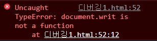

2022. 06. 13
<br /><br />

# 서버-클라이언트 

## 웹 서버 
- 서비스 제공
- 서버에 미리 만들어진 문서를 두고 (html, css, image) 웹 클라이언트가 문서를 요청하면 해당 문서를 찾아서 웹 클라이언트에게 전송하는 일을 한다.
<br /><br />

## WAS(Web Application Server)
- jsp를 해석해서 새로운 문서를 만들어 클라이언트에게 전송한다.
- ex. tomcat, weblogic(대기업), jeus(국가기관, tmax가 제작), resine ......
<br /><br />

## 웹 클라이언트(브라우저)
- 서비스 요청
- 정적 웹 페이지만 서비스를 한다. 
- html, css, js 번역기 역할
- 페이지 요청을 하면 해당 문서를 웹을 통해 서버에서 문서를 다운로드(로컬에 저장) -> 번역해서 화면에 출력
<br /><br />

### 웹 접근성
- 내가 언제 어디서 무슨 상황에 처해있든지 웹을 사용함에 있어 불편함이 없도록 하는 것
<br /><br />

## 서버 - java

      html, css, js, jsp
                                                 Ajax 통신         (데이터를 JSON 형태로)
    클라이언트  <--------->  프론트엔드  <-------------------------> 백엔드
                            ----------                             -------
                            node.js 서버기반 (html, css, js)         자바
                            angular, react, vue, polymer

<br /><br />

## 시멘틱 태그

<ol>
<li>웹 브라우저가 HTML 소스 코드만 보고도 어느 부분이 제목이고 메뉴이고 본문 내용인지 쉽게 알 수 있음</li>
<li>문서 구조가 정확히 나눠지므로 PC나 모바일의 웹 브라우저와 여러 스마트 기기의 다양한 화면에서 웹 문서 표현 쉬움</li>
</ol>

<br /><br /><br />

-----
-----
-----

<br /><br /><br />

2022. 6. 14

# HTML
 
## 이미지
웹에 사용하는 이미지는 파일 크기가 크지 않으면서 화질이 좋아야 함
<ol>
<li>jpeg, jpg : 비트맵 이미지(크기가 큼)를 압축한 것</li>
<li>gif</li>
<li>png : gif 유료화로 인해 개발된 무료 형식</li>
</ol>

<br />

### 이미지 경로
<ol>
<li>상대경로 : 보통 많이 사용하는 지정 방식
<ul>
<li>'.' : 현재 디렉토리 기준</li>
<li>'..' : 상위 디렉토리 기준</li>
</ul>
<li>절대경로 : 서버에는 많은 프로젝트의 이미지가 존재하기 때문에 절대경로 사용 시 수정이 어려움</li>
</ol>
<br />

## 오디오와 비디오
&lt;object&gt;
<br />
속성 : 
controls(컨트롤 바 유무), autoplay(자동재생여부), <br />
loop(반복재생여부), mute(소리 제거),<br />
width, height
<br /><br />

## anchor(닻 = 링크)
속성 : name, target(문서를 띄울 방식)<br />
form 태그 안의 input이어야 서버로 데이터 전송이 가능
<br /><br />

## form 
### method
<ol>
<li>
get(default) : 입력 길이 제한, 데이터 전송 시 사용자가 입력한 내용이 주소표시줄에 나타남, 한글 전송 X(별도의 가공 필요)
</li>
<li>
post(파일 전송 시 post 사용해야 함) : 입력 내용 길이 제한 X, 사용자가 입력한 내용 드러나지 않음
</li>
</ol>

<br /><br />

## id와 name의 차이
id : 모든 태그들이 가질 수 있는 속성, 하나의 HTML 내에 유일한 요소의 이름 => 자바스크립트와 관련

name : 입력 양식 태그(input, textarea, select)만 가질 수 있는 속성, 중복 가능 => 서버와 관련

<br /><br />

## form 요소


fieldset : 폼 요소 그룹

label : 폼 요소에 이름(라벨)을 붙임
<br /><br />

## input

html 파일 간의 정보를 공유하기 위해서는 요소에 담아 전송해야 함
(html 문서 상에서 벌어진 이벤트를 다른 html 문서에서는 알 수 없음)

### input 속성
- autocomplete : 자동완성
- autofocus : 자동으로 입력 커서를 갖다 놓음
- required : 필수 작성 input
- placeholder : 텍스트 입력란에 적당한 힌트 내용 표시

<br /><br /><br />

# CSS 

## 기본 선택자
<ul>
<li>
  전체 선택자 : *
</li>
<li>
클래스 선택자 : .
  
모든 요소에 적용 가능하다.
</li>
<li>
아이디 선택자 : #
  
화면에 출력되는 데에는 중복 id 문제 없음
js로 요소를 선택할 때 문제가 생김
</li>    
</ul>

## div와 span의 차이점
<ul>
<li>div : block 요소</li>
<li>span : inline 요소</li>
</ul>

## 스타일 우선순위
<ol>
<li>!important</li>

- 어떤 스타일보다 우선 적용하는 스타일
- 특별한 경우를 제외하고는 잘 안씀..

<li>인라인 스타일</li>

- 태그 안에 style 속성을 사용해 해당 태그만 스타일 적용

<li>id 스타일</li>

- 지정한 부분에만 적용되는 스타일이지만 한 문서에 한 번만 적용할 수 있음

<li>클래스 스타일</li>

- 웹 문서에서 지정한 부분에만 적용되는 스타일로 한 문서에 여러 번 적용할 수 있음

<li>타입 스타일</li>

- 웹 문서에 사용한 특정 태그에 스타일을 똑같이 적용
</li>
</ol>

<br /><br /><br />

# 자바스크립트 

- 자바스크립트는 인터프리터 언어로, 브라우저에서 해석한다.
- console은 주로 디버깅용으로 사용한다.
  - console.log("Hello javascript!");
- 자바스크립트는 원래 문장 끝에 ;을 붙여야 한다.
- 자동으로 ;이 있는 것으로 인식한다.
- 인터프리터 언어들은 대부분 변수 선언이 필요 없다.
- 인터프리터 언어는 에러가 다양하지 않아서 에러 원인을 파악하기 어렵다.
  
  
## 람다 표현식
[1, 2, 3].forEach(element => console.log(element));

<br /><br /><br />

-----
-----
-----

<br /><br /><br />

2022. 6. 15

# CSS
## Font

### font-size
- em : 부모 요소 폰트의 대문자 M 너비 기준
- rem : root 폰트 기준
- px : 모니터 1픽셀 기준
- pt : 포인트

### font-style
- normal : 기본
- italic : 기울임체

### font-weight
- normal(400)
- bold(700)

### line-height
- 한 문단이 두 줄 이상이면 줄 간격이 생김
- 줄 간격이 너무 좁거나 넓으면 가독성이 떨어짐
- line-height 속성을 이용하여 줄 간격을 원하는 만큼 조절 가능

### text-decoration
- none : 기본
- underline : 밑줄
- overline : 윗줄
- line-through : 취소선


## Layout

### display
- block : 인라인 레벨 요소를 블록 요소 레벨로 만듦
- inline : 블록 레벨 요소를 인라인 레벨 요소로 만듦
- inline-block : 인라인 레벨 요소와 블록 레벨 요소의 속성을 모두 가지고 있으며 마진과 패딩 지정 가능
- none : 해당 요소를 화면에 출력하지 않음

### float
- 웹 요소를 문서 위에 떠 있게 만듦


## 웹 요소 위치 지정

### 위치 속성
- left : 기준 위치와 요소 사이의 왼쪽 거리 설정
- right : 기준 위치와 요소 사이의 오른쪽 거리 설정
- top : 기준 위치와 요소 사이의 위쪽 거리 설정
- bottom : 기준 위치와 요소 사이의 아래쪽 거리 설정

### position
- static : 문서의 흐름에 맞춰 배치 (기본값)
- relative : 현재 요소의 위치 기준 (static과 유사)
- absolute : static이 아닌 상위 요소 기준
- fixed : 브라우저 창 기준


## Box Model
- content
- padding
- border
- margin

<br /><br /><br />

# 자바스크립트

## console 창으로 debug
```
document.writ();
```
 
자바스크립트 에러가 콘솔 창에 출력됨
  

## "use strict";
자바스크립트의 원래 문법보다 더 엄격하게 만들어 줌

## 호이스팅
함수 안에 있는 선언들을 모두 끌어올려서 해당 함수 유효 범위의 최상단에 선언하는 것을 말한다.

## Array

### 배열 생성 방법
<ol>
<li>
선언, 대괄호([])를 사용하여 생성

```
let arr = [];
```

</li>
<li>
Array 객체와 new 키워드로 생성

```
let arr = new Array();
```
</li>
</ol>

### 배열 관련 메서드
- arr.push(a) : a를 배열 arr의 가장 뒤에 삽입
- arr.concat(a, b, c) : 배열 arr에 a, b, c를 붙임(삽입) -> 배열 원본 변경 X
- arr.join("(구분자)") : 배열 요소를 문자열로 묶어줌 -> 배열 원본 변경 X

## 등호 연산자
- '==' : 자바스크립트의 자동 형변환으로 인해 자료형에 관계없이 값이 같으면 같다는 결과를 출력
- '===' : 자료형과 값을 함께 비교

<br /><br /><br />

-----
-----
-----

<br /><br /><br />

2022. 6. 16

# CSS

## background
### background-image
```
background-image: url('이미지 경로');
```

### background-repeat
: 배경 이미지를 가로와 세로 중에서 어떤 방향으로 반복할지 지정하거나, 반복하지 않고 한 번만 나타나게 할 수 있음
- repeat : 브라우저 화면을 가득 차게 가로, 세로 모두 반복
- repeat-x : 가로 반복
- repeat-y : 세로 반복
- no-repeat : 반복  X

### background-position
: 배경 이미지의 수평 위치 또는 수직 위치 값 지정
```
background-position: <수평 위치> <수직 위치>
```

### background-origin
: 배경 이미지를 적용할 범위 지정
- content-box
- padding-box
- border-box

### background-attachment
: 배경 이미지를 원하는 위치에 고정
- scroll : 화면을 스크롤 하면 배경 이미지도 스크롤 된다. (기본값)
- fixed : 화면을 스크롤 해도 이미지는 고정되어 있다.

<br>
<br>

## Selector
### 하위 선택자 (자손 선택자)
: 부모 요소에 포함된 하위 요소를 모두 선택, 공백
```
부모요소 자식요소
```

### 자식 선택자
: 자식 요소에만 스타일을 적용하는 선택자, 
```
부모요소 > 자식요소
```

### 형제 선택자
#### 인접 형제 선택자
: 형제 요소 중 첫 번째 동생 요소만 선택, +
```
요소1 + 요소2
```

#### 형제 선택자
: 모든 형제 요소 선택
```
요소1 ~ 요소2
```

### 속성 선택자
#### [속성] 선택자
:속성값에 따라 원하는 요소 선택
  
특정 속성이 있는 요소 선택

```
a[href] { 
  ...
}
```
: href 속성을 가지고 있는 a 요소 선택

#### [속성=속성값] 선택자
: 특정 속성값이 있는 요소 선택
 
주어진 속성과 속성값이 일치하는 요소를 찾아 스타일 지정할 때 사용

```
a[target = _blank] { 
  ... 
}
```

<br>
<br>

## 가상 클래스와 가상 요소
### 사용자 동작에 반응하는 가상 클래스
- :link 가상 클래스 선택자 : 방문하지 않은 링크에 스타일 적용
- :visited 가상 클래스 선택자 : 방문한 링크에 스타일 적용
- :hover 가상 클래스 선택자 : 특정 요소에 마우스 포인터를 올려놓으면 스타일 적용
- :active 가상 클래스 선택자 : 웹 요소를 활성화했을 때 스타일 적용
- :focus 가상 클래스 선택자 : 웹 요소에 초점이 맞추어졌을 때 스타일 적용
  
### 요소 상태에 따른 가상 클래스
- .target 가상 클래스 선택자 : 앵커 대상에 스타일 적용
- .enabled와 .disabled 가상 클래스 선택자 : 요소의 사용 여부에 따라 스타일 적용
- .checked 가상 클래스 선택자 : 선택한 항목의 스타일 적용
- .not 가상 클래스 선택자 : 특정 요소를 제외하고 스타일 적용

### 구조 가상 클래스

### 가상 요소
- ::first-line : 첫 번째 줄 선택
- ::first-letter : 줄에서 첫 번째 글자 선택
- ::before : 특정 요소의 앞에 내용이나 스타일 추가
- ::after : 특정 요소의 뒤에 내용이나 스타일 추가

<br><br><br>  

# 반응형 웹
: 웹 요소를 화면 크기에 맞게 재배치하고 각 요소의 표시 방법만 바꾸어 사이트 구현

## viewport
: 스마트폰 화면에서 실제 내용이 표시되는 영역
- ```<meta http-equiv="X-UA-Compatible" content="IE=edge">```  
 : edge 브라우저 호환성을 위한 태그
- ```<meta name="viewport" content="width=device-width, initial-scale=1.0">```  
 : 모바일 가로, 세로 방향 화면 출력을 위한 태그

<br />
<br />
<br />
<br />

# JS

## 조건문
### if 문
```
let year = prompt("연도를 입력하세요.");

if (year%4===0 && year%100!==0 || year%400===0 )
 console.log(`${year}년은 윤년입니다.`);
else
 console.log(`${year}년은 윤년이 아닙니다.`);
```

<br />

## 반복문

### while 문
```  
let i = 1;
while (i <= 10) {
  console.log(i);
  i++;
}
```

### for 문
```
let flowers = ["작약", "백일홍", "접시꽃", "천일홍", "목단", "진달래", "장미"];
```
```
for (i=0; i < flowers.length; i++) 
 console.log(flowers[i]);
```
```
for (i in flowers)
 console.log(flowers[i]);
```
```
for (item of flowers)
 console.log(item);
```
```
flowers.forEach(item => console.log(item));
```

<br />

## JSON
```
let person = {"name": "홍길동", "age": 18,};
console.log(person["name"]); // '홍길동'
console.log(person["age"]); // 18
console.log(person.name); // '홍길동'
console.log(person.age); // 18
```

### JSON 배열
```
let personList = [
  { "name": "홍길동", "age": 23, "phone": "010-0000-0000", "address": "신림동" },
  { "name": "임꺽정", "age": 27, "phone": "010-0000-0001", "address": "봉천동" },
  { "name": "장길산", "age": 26, "phone": "010-0000-0002", "address": "서초동" },
  { "name": "홍경래", "age": 28, "phone": "010-0000-0003", "address": "양재동" },
  { "name": "강감찬", "age": 33, "phone": "010-0000-0004", "address": "낙성대" }
];
  
  
// for 문
for (i = 0; i < personList.length; i++) 
 console.log(`${personList[i].name} ${personList[i].age} 
  ${personList[i].address} ${personList[i].phone}`);

// for in 문
for (i in personList)
 console.log(`${personList[i].name} ${personList[i].age}
   ${personList[i].address} ${personList[i].phone}`);

// for of 문
for (person of personList)
 console.log(`${person.name} ${person.age}
  ${person.address} ${person.phone}`);

// forEach 문
personList.forEach(person => 
 console.log(`${person.name} ${person.age}
  ${person.address} ${person.phone}`));
```
